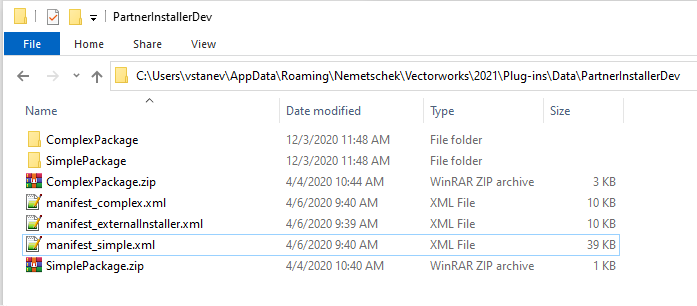

By [devsupport@vectorworks.net](mailto:devsupport@vectorworks.net)

## Intro

Vectorworks 2021 introduced a feature called 'Install Partner Products' (as a menu command under the Help menu) that allows users to browse and install features from third-party developers.

As a developer, if you are interested in listing your products/features there, please contact us at [devsupport@vectorworks.net](mailto:devsupport@vectorworks.net).

## The Install Package

The Install Partner Products feature works with packages, provided by the developer, and uploaded on the Vectorworks online storage.

Example install packages can be downloaded at [PartnerInstallPackage_Example.zip](examples/PartnerInstallPackage_Example.zip).

The third-party developer will provide one or several packages of their product. A package can, if needed, encapsulate the plugins for a Vectorworks version, Vectorworks product, OS system, and the third-party product version. For simple third-party products, there could be one package for everything, or any set of the above as needed.

The packages should be provided together with a manifest file, that contains information how a product/feature should be presented to the user and how it should be installed from the package.

### Structure

A package is a zipped up folder containing the following:
* `Plug-ins` folder – *optional*. Any files there will be copied over to the user’s plugins folder under the company/developer name.
* `Workspaces` folder – *optional*. Any files there will be copied into the user’s workspace folder.
* `Libraries` folder – *optional*. Any files there will be copied into the user’s libraries folder.
* `install.py/.vs` file – *optional*. An advanced third-party developer feature. Executed during install.
* `uninstall.py/.vs` file – *mandatory* if ‘install’ script is available, or *optional* if not. An advanced third-party developer feature. Executed during uninstall.
* `add_to_workspace.py/.vs` file – *optional*. An advanced third-party developer feature. Executed during first install, or when the user requests the product to be added to the current workspace.
* `remove_from_workspace.py/.vs` file – *optional*. An advanced third-party developer feature. Executed during uninstall, or when the user requests the product to be removed to the current workspace.

### Manifest

Here is an example structure of a manifest file. It can contain one or several product definitions, listing information about the product/feature and defining how the packages should be related to the product/feature.

**Note**: The product identifier number **MUST** be a new unique number to ensure that there won't be any conflicts with other products. You can use online GUID generators, like [GUID Generator](https://www.guidgenerator.com/online-guid-generator.aspx).

```xml
<PartnerProducts>
    <Product id="0DD4D484-C641-49A1-B4F0-736BFCE670CF">
        <Subfolder>NBS Chorus</Subfolder>
        <Title>NBS Chorus</Title>
        <Category>The category</Category>
        <Info>The NBS Chorus integration enables users to access and dynamically link their models to the NBS online specification database, keeping the model as the central source of project information. Users will be able to open a web palette in Vectorworks, letting them work concurrently with their model and NBS Chorus. Any data modified in NBS Chorus via the web palette will update in the data record of the model, ensuring accurate and up-to-date specification information is accessible at all times from the model. The NBS Chorus integration is another step in creating a holistic BIM environment within Vectorworks. NBS Chorus integration will be available to users of Vectorworks Design Series products with an active membership in Vectorworks Service Select.</Info>
        <Image>Logo.png</Image>
        <Thumbnail>LogoThumbnail.png</Thumbnail>
        <Developer>Vectorworks Inc.</Developer>
        <Website>https://www.thenbs.com/nbs-chorus</Website>
        <License>Free</License>
        <Version>1.0</Version>
        <ReleaseDate>3/17/2020</ReleaseDate>
        <Packages>
            <Package os="win" vectorworks="2020" product="d,a,l,s">
                InstallPackage2020Win.zip
            </Package>
            <Package os="mac" vectorworks="2020" product="d,a,l,s" external="true">
                www.mycompany.com/external_installer.dmg
            </Package>
        </Packages>
    </Product>
</PartnerProducts>
```

Each product will define:
* **Id** – a unique identifier of the product. Use online GUID generator, like: [GUID Generator](https://www.guidgenerator.com/online-guid-generator.aspx)
* **Subfolder** – a subfolder for the plug-ins directory
* **Title** – a name of the product. Can be duplicated with a 'lang' attribute for alternative titles in different languages. See the note below.
* **Category** – a category of the product. This will be managed by Vectorworks to keep consistency so similar products appear in similar categories. Can be duplicated with a 'lang' attribute for alternative category in different languages. See the note below.
* **Info** – a detailed description of the product. Can be duplicated with a 'lang' attribute for alternative info in different languages. See the note below.
* **Image** – a URL or BASE64 of the full size image of the product. If a BASE64 image is provided it must be prefixed by `data:image/png;base64, `. You can use online tools to generate BASE64 for an image file, like: [Base64 Image](https://www.base64-image.de/)
* **Thumbnail** – *optional* – a URL or BASE64 of the thumbnail image of the product. If missing, the ‘Image’ will be used.
* **Developer** – the name of the developer/company that produced the plugin.
* **Website** – a URL to for more information about the product and/or the developer.
* **License** – a textual information about the license of the plugin. Currently every Vectorworks user will be able to install this product. Any more other licensing scheme must be implemented and supported by the developer of the plugin.
* **Version** – a version of the product for reference.
* **ReleaseDate** – the release date information for reference.
* **Packages** – a group defining the set of packages that will be used for this product. This could be any number of packages depending on technical or any other reasons, decided by the developer of the plugin.
  * Each package is listed by the name of the .zip file containing the package (the files) as defined above.
  * Vectorworks will choose which package to be installed based on the attributes of each `<Package>` node. The first matching package will be used in the case there are overlapping attributes.
  * The possible attributes are:
    * **os** – *optional* – set to ‘win’ or ‘mac’, or left empty (or missing) would indicate both.
    * **vectorworks** – *optional* – set to the version of Vectorworks which this package applies. If missing would indicate any.
    * **product** – *optional* – a list of comma separated abbreviations for the Vectorworks product for which this package applies. If missing would indicate any:
      * f - Fundamentals
      * d - Designer
      * a – Architect
      * l – Landmark
      * s – Spotlight
      * c – ConnectCad
      * b – Braceworks
    * **lang** – *optional* – a language for this package defined as the ISO 639-1 code. See the note below for details.
    * **external** – *optional* – denotes that the install package is an OS installer, that will be downloaded and executed. Vectorworks will not be able to provide uninstaller for this feature and will ask the users to use the OS uninstall.

**Note**: The ‘Title’, ‘Category’, and ‘Info’ tags as well as the 'Package' tags can be repeated with a unique value for ‘lang’ attribute to define alternative values for different Vectorworks localizations. This attribute should contain ISO 639-1 code  (https://en.wikipedia.org/wiki/List_of_ISO_639-1_codes). Currently supported codes by the system are: DE, FR, JA, PL, ZN, IT, NO, PT, ES, NL, and EN. If the attribute is missing, EN is assumed.

## The Process

* When the user clicks the 'Install' button:
  1. The manifest will be analyzed by Vectorworks to determine which `<Package>` will be used.
  2. Vectorworks will download this package and unzip it into the `<user>/Plug-ins` folder inside the specified `<Subfolder>` defined in the manifest.
  3. Then the ‘modify_workspace.py/.px’ will be executed if available.
    * This script will be executed while Vectorworks is running, so you can use any Script API available, including the workspace modification functions listed below.
    * The script will have access to predefined variables:
      * "PackageID" - type GUID - corresponds to `<Product id="">` element from manifest file.
      * "IsUpdated" - type Boolean - True -  if Update button is pressed( Update product process has been started ), False - otherwise.
  4. Vectorworks will restart, and during restart, after all plugins are unloaded, it will execute the ‘install.py/.px’ from the package if present. This is with because the installation might need to work with existing files that must not be locked by the Vectorworks running.
    * This script will be executed just before Vectorworks shuts down, so there might be limited access to API but Python API should be available.
    * The script will have access to predefined variables:
      * "PackageID" - type GUID - corresponds to `<Product id="">` element from manifest file.
      * "IsUpdated" - type Boolean - True -  if Update button is pressed( Update product process has been started ), False - otherwise.

Similarly to the install, the uninstall will only run the workspace scripts on the button. The uninstall script and file deletion will happen on Vectorworks quit. This will make possible removing plugins that might be in use by Vectorworks.

The update process will uninstall the product and install it again according to the above described processes.

## Testing

For developer testing purposes a special folder will be traversed by Vectorworks to look for manifests and packages to be included in addition to the cloud content. This way a developer can create and test their installer. It’s a good idea to set a clearly identifiable category, so these extra packages can be found in the user interface.

The special folder is located (you will have to create it if it doesn't exist already) at `<user folder>/Plug-ins/Data/PartnerInstallerDev`

The developer should put one or more .xml files for the manifest, and the .zip files for the packages referenced by the manifest.

**Note**: This folder is local, only for testing purposes, to simulate the package being available.

Here is an image of the examples:



**Note**: The folders in the image are there only to create the .zip files. They are not traversed or looked into by Vectorworks. They are there for convenience, to change the data into folder, and then zip up the entire folder to produce the package .zip file.

## Scripting Functions

The following Script functions will be revised and added so they can be used in the `add_to_workspace.py/.vs` and `remove_from_workspace.py/.vs` scripts

```python
# Begin workspace edit. Use the other wsEdit* calls and must end with a call to wsEditEnd.
def vs.wsInstallFailed(failed):    return None

# Begin workspace edit. Use the other wsEdit* calls and must end with a call to wsEditEnd.
def vs.wsEditBegin(companyName):    return None

# Begin workspace edit. Use the other wsEdit* calls and must end with a call to wsEditEnd.
def vs.wsEditBeginN(companyName, companyToolSetIconFilePath):    return None

# Finishes workspace edit started with wsEditBegin.
def vs.wsEditEnd(restart):    return BOOLEAN

# Add a menu under Tools -> Third-party. Use dot as a delimiter for sub menus in 'commandName'.
def vs.wsEditAddMenu(menuPath):    return None

# Add a menu under Third-party palette and companyName tool set.
def vs.wsEditAddTool(toolName, toolType):    return None

# Add a menu under Third-party palette and companyName tool set. The menu is added underneath another existing tool in the tool set.
def vs.wsEditAddTool2(toolName, underToolName, toolType):    return None

# Delete all menu commands and tools under the specified 'companyName' added with 'wsEditBegin'.
def vs.wsDelete(companyName, restart, reload):    return None

# Workspace advanced APIs. Offers restart or reload of the workspace to commit the changes made by this APIs.
def vs.ws2CommitChanges(restart, reload):    return None

# Workspace advanced APIs. Return the number of menu items at the specified path. Use '/' for path delimiter of universal menu names.
def vs.ws2GetMenusCnt(menuPath):    return INTEGER

# Workspace advanced APIs. Return the universal name of the specified index inside the provided menu path See 'ws2GetMenusCnt'.
def vs.ws2GetMenuAt(menuPath, index):    return DYNARRAY[] of CHAR

# Workspace advanced APIs. Return the localized (if any) name, and shortkey combinations (if any) of the specified index inside the provided menu path. See 'ws2GetMenusCnt'.
def vs.ws2GetMenuInfo(menuPath):    return DYNARRAY[] of CHAR(Display Name), BOOLEAN(HasShortkey), CHAR(Shortkey), INTEGER(ShortkeyModifier)

# Workspace advanced APIs. Set the localized (if any) name, and shortkey combinations (if any) of the specified index inside the provided menu path. See 'ws2GetMenusCnt'.
def vs.ws2SetMenuInfo(menuPath, displayName, hasShortcutKey, shortcutKey, shortcutKeyModifier):    return None

# Workspace advanced APIs. Return the indx of the specified universal name inside the provided menu path. Return -1 if not found. See 'ws2GetMenusCnt'.
def vs.ws2FindMenuIndex(menuPath, findMenuUnivName):    return INTEGER

# Workspace advanced APIs. Adds a new menu group (container) by universal name before the specified index (-1 for the end) inside the provided menu path. See 'ws2GetMenusCnt'.
def vs.ws2AddMenuGroup(menuPath, newUnivName, newDisplayName, beforeIndex):    return BOOLEAN

# Workspace advanced APIs. Adds a new menu item by universal name before the specified index (-1 for the end) inside the provided menu path. See 'ws2GetMenusCnt'.
# vs.ws2AddMenuItem(menuPath, '-', beforeIndex ) creates a menu separator.
def vs.ws2AddMenuItem(menuPath, newMenuUnivName, beforeIndex):    return BOOLEAN

# Workspace advanced APIs. Delete the menu at the specified index and menu path. See 'ws2GetMenusCnt'.
def vs.ws2DelMenuAt(menuPath, index):    return BOOLEAN

# Workspace advanced APIs. Delete the menu at the specified menu path. See 'ws2GetMenusCnt'.
def vs.ws2DelMenu(menuPath):    return BOOLEAN

# Workspace advanced APIs. Return the number of tools at the specified path composed of universal names <tool palette>/<tool set>. See 'ws2GetMenusCnt'.
def vs.ws2GetToolsCnt(toolPath):    return INTEGER

# Workspace advanced APIs. Return the tool univ name at the specified index of the parent tool or tool set at the specified path. See 'ws2GetMenusCnt'.
def vs.ws2GetToolAt(toolPath, index):    return DYNARRAY[] of CHAR

# Workspace advanced APIs. Return the tool information at the specified index of the parent tool at the specified path. See 'ws2GetMenusCnt'.
def vs.ws2GetToolInfo(toolPath):    return BOOLEAN(Ok), DYNARRAY[] of CHAR(DisplayName), CHAR(Shortkey), INTEGER(ShortkeyModifier), INTEGER(ResourceID)

# Workspace advanced APIs. Set the tool information at the specified index of the parent tool at the specified path. See 'ws2GetMenusCnt'.
def vs.ws2SetToolInfo(toolPath, displayName, shortcutKey, shortcutKeyModifier, resourceID):    return None

# Workspace advanced APIs. Return the named tool index at the specified path. See 'ws2GetMenusCnt'.
def vs.ws2FindToolIndex(toolPath, findUnivName):    return INTEGER

# Workspace advanced APIs. Create a new tool palette if it doesn't exist.
def vs.ws2CreateToolPalette(univName, displayName):    return BOOLEAN

# Workspace advanced APIs. Create a new tool set if it doesn't exist. Retina icon will be loaded automatically if it has the same name suffixed with @2x.png and resolution 26 by 20 pixels.
def vs.ws2CreateToolSet(toolPath, univName, displayName, iconFullFilePath):    return BOOLEAN

# Workspace advanced APIs. Create a new tool.
def vs.ws2CreateTool(toolPath, univName, resourceID):    return BOOLEAN

# Workspace advanced APIs. Delete the tool, tool set, or tool palette at the specified menu path. See 'ws2GetMenusCnt'.
def vs.ws2DelTool(toolPath):    return BOOLEAN
