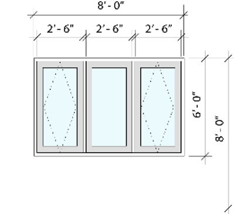

By [Josh Loy](mailto:jloy@nemetschek.net)

## Automatic dimension support

Graphic Legends have provisions for automatic dimensioning which is especially useful for doors and windows but it can be included with almost any plug-in object.

The different types of auto-dimensions are identified by a universal name, Vectorworks provides some predefined types in the following string file: `Vectorworks/Strings/AutoDimensionIdentifiers.vwstrings`

Developers can implement some, none, or all of the predefined types or provide their own custom types. Auto-dimensions may be restricted to be visible in certain views or orientations, and they may also be stacked.



To support auto-dimensioning your plug-in should implement the following event sync functions:

- **OnAutoDimMessage_GetLocalizedTypeName** - Has the universal name as the input parameter and the developer will output the translated long name/description. Most time you would just look for the universal name in the vwstrings file above and return the long string.
- **OnAutoDimMessage_GetSupportedTypes** - Has the "view" as in input and the developer will output an array of `TAutoDimensionTypeInfo` which contains the universal names for dimension types supported for that view along with the orientation/location of its supported dimensions.
- **OnAutoDimMessage_GetDimensionDefinitions** - Has the "view", universal name, and orientation as input parameters and the developer will output an array of `TAutoDimensionDefinition` which contains 3D points to place the dimensions along with an "offset" parameter. The "offset" parameter (1,2,3...) is used to control the stacking of dimensions, usually defaulted to 0, adding 1 will make the dimensions stack on 0 dimensions, 2 will stack on 1, etc.

### Sample SDK code

To implement auto-dimensioning by modifying `Plug-Ins\Samples\TesterModule\Source\Advanced`:

#### ExtObjAdvComplex.h
```cpp
class CObjAdvComplex_EventSink : public VWParametric_EventSink
{
public:
	// ...existing code...
	virtual bool OnAutoDimMessage_GetLocalizedTypeName(const TXString& instrDimID_UniversalName, TXString& outstrDimID_LocalizedName);
	virtual bool OnAutoDimMessage_GetSupportedTypes(EViewTypes inView, std::vector<VectorWorks::Extension::TAutoDimensionTypeInfo>& outvecTypes);
	virtual bool OnAutoDimMessage_GetDimensionDefinitions(EViewTypes inView, const TXString& instrDimID_UniversalName, 
		VectorWorks::Extension::EAutoDimensionPlacement inPlace, 
		std::vector<VectorWorks::Extension::TAutoDimensionDefinition>& outvecDimensions);
};
```

#### ExtObjAdvComplex.cpp
```cpp
//////////////////////////////////////////////////////////////////////////////
// Auto Dimension handler
//////////////////////////////////////////////////////////////////////////////
// Universal Names in "AutoDimensionIdentifiers.vwstrings"
enum EDimIDIndex { kUnit, kUnitBottomSash, kPIOCustom, kNumDimIDs};
const TXString karrstrDimIDUniversal[kNumDimIDs] = { "Unit", "UnitBottomAndSash", "ThisPluginCustom" };
const TXString kThisPluginCustomDimName = "Custom PIO Dimension";

// ...existing code...

bool CObjAdvComplex_EventSink::OnAutoDimMessage_GetLocalizedTypeName(const TXString& instrDimID_UniversalName, TXString& outstrDimID_LocalizedName)
{
	// ...existing code...
}

bool CObjAdvComplex_EventSink::OnAutoDimMessage_GetSupportedTypes(EViewTypes inView, std::vector<VectorWorks::Extension::TAutoDimensionTypeInfo>& outvecADTI)
{
	// ...existing code...
}

bool CObjAdvComplex_EventSink::OnAutoDimMessage_GetDimensionDefinitions(EViewTypes inView, const TXString& instrDimID_UniversalName, 
	VectorWorks::Extension::EAutoDimensionPlacement inPlace, 
	std::vector<VectorWorks::Extension::TAutoDimensionDefinition>& outvecDimensions)
{
	// ...existing code...
}
```

### Sample VS code

To implement auto-dimensioning:
```pascal
PROCEDURE EventWrapper;
CONST
	// ...existing code...

VAR
	// ...existing code...

BEGIN { EventWrapper }
	vsoGetEventInfo( theEvent, stateMessage );
	isObjOK := SetUpObject( gPluginName, gPluginH, recordH, wallH, saveClass, noneClass );
	
	CASE theEvent OF
		kObjOnInitXProperties:
		BEGIN
		END;

		kADP_GetCategoryName:
		BEGIN
			// ...existing code...
		END;

		kADP_GetLocTypeName:
		BEGIN
			// ...existing code...
		END;

		kADP_GetSupportedTypes:
		BEGIN
			// ...existing code...
		END;

		kADP_GetDefinitions:
		BEGIN
			// ...existing code...
		END;

		kResetEventID:
		BEGIN
			DoorLikeObject;
		END;
	END;
END;

RUN (EventWrapper);
```
