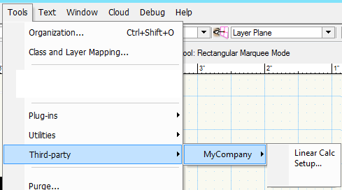
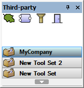

By [Vladislav Stanev](mailto:vstanev@nemetschek.net)

## Note

This is a Vectorworks 2018 feature.

## Intro

Script developers will be able to create installation scripts of their menus and tools.
These installation scripts will use API to allow menu and tool insertion into the current workspace. The location will be predetermined and the user will not be able to change it.

## Menu Commands

New menu commands will be installed under Tools -> Third-party menu popup inside popup with the name of the company name. The user can add menus in the company menu, or specify menu popup structure under it.
The company name and the menu path will be expected as parameters of the API.

An example of third-party menus installed under company name ‘MyCompany'.



Here is the code of the example menu commands displayed in the figure above:

```python
vs.wsEditBegin('MyCompany')
vs.wsEditAddMenu('VS_linear_Calc')
vs.wsEditAddMenu('VS_Setup')
vs.wsEditEnd(True)
```

*Note:* The parameter with the menu command name can contain /-delimited path to place the menu command inside popup. E.g. 'SubMenu/VS_Linear Calc'

*Note:* The Third-party menu command will not be available until at least one menu is registered there.

## Tools

New tools will be installed inside Third-party palette. The company name will be used to create tool sets.

Example third-party tool set.



Tools can be installed as either standalone tools or as subtools of existing tools. The appropriate function must be called in each case and the type of tool must also be specified when calling the function.

| Tool Type             | Constant |
|-----------------------|----------|
| Regular External Tool | 1        |
| VectorScript Tool (.vst) | 2    |
| VectorScript Object (.vso) | 3   |
| Custom Parametric     | 4        |

*Note:* The Custom Parametric tool type includes SDK objects of type Point, Line, Box, 2D Path, and 3D Path.
