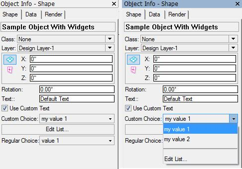

By [Vladislav Stanev](mailto:vstanev@nemetschek.net)

## What's that

Parametric Objects can customize the [Object Info - Shape Pane](VS:Parametric Custom Shape Pane Popup) palette in VectorWorks.


By default, the "Object Info - Shape Pane" palette shows the parameters of the parametric object as they are defined by the VectorScript plug-in editor. The types of the widgets that appear in the palette are determined by the types of the parameters.

## The Problem

A parametric plug-in is able to override that standard behavior and customize the appearance of the "Object Info - Shape Pane" Palette.

This approach allows a complex plug-in parametric to make a good distinction between data and UI of the parameters.

* Data is the internal record that holds the parameters of the object; Data is defined with the Plug-in Object Parameters. This represents one format with the name of the object which is created when an object of this type is created. Each instance of that object contains a record instance in its AUX list holding the parameters for that particular parametric object instance.

* UI is the custom-defined widgets that appear in the Shape pane. The plug-in can define the widgets that appear in the shape pane and can bind them to the parameter's data. This will make VectorWorks automatically transfer data between the widgets and the parameters record.

The sample demonstrated here defines a plug-in parametric object with one custom and one normal popup. The custom popup has an 'Edit List...' option at the end, that allows the list contents to be edited through a dialog.

The resulting sample object's shape pane looks like this:



## Initialization

If you want your plug-in to control the widgets that appear in the "Object Info - Shape Pane" Palette, you must have an event-enabled VectorScript plug-in.

Then you have to handle the extended properties event, and set up the widgets for your plug-in:

```vs
BEGIN {MAIN}
  result := GetCustomObjectInfo(objectName, objectHand, recordHand, wallHand);
  vsoGetEventInfo(theEvent, message );

  CASE theEvent OF
    5: {kObjOnInitXProperties}
    BEGIN
      result := SetObjPropVS(8, TRUE); {kObjXPropHasUIOverride}
      result := SetObjPropVS(12, TRUE); {kObjXHasCustomWidgetVisibilities}
      result := vsoInsertAllParams;
      result := vsoInsertWidget (3, 12 {kWidgetButton}, 100, 'Edit List...', 0);
    END;
```

* kObjXPropHasUIOverride (8) -- set to TRUE to enable customization of the widgets. Setting this to TRUE puts in the hands of the plug-in creating of the widgets. This means that if the plug-in doesn't put widgets the info palette will contain no widgets;

* kObjXHasCustomWidgetVisibilities (12) -- set to TRUE to enable custom widget visibility event. This allows the plug-in to control the widget state in the info palette.

* [vsoInsertAllParams](VS:vsoInsertAllParams) will add all parameters as widgets. Each widget will have its ID from the index of the parameter.

* [vsoInsertWidget](VS:vsoInsertWidget) will insert a button widget after the third existing widget, and the new button widget will be with ID=100.

## Updating widget state

```vs
  41: {kObjOnWidgetPrep}
  BEGIN
    vsoWidgetSetVisible( 1, PUseCustomText );
    vsoWidgetSetEnable( 3, PUseCustomText );
    vsoWidgetSetEnable( 100, PUseCustomText );

    vsoWidgetPopupClear( 3 );
    vsoWidgetPopupAdd( 3,'1', 'item 1' );
    vsoWidgetPopupAdd( 3,'2', 'item 2' );
    vsoWidgetPopupAdd( 3,'div', '-' );
    vsoWidgetPopupAdd( 3,'list', 'Edit List...' );

    vsoSetEventResult( -8 {kObjectEventHandled} );
  END;
```

By referencing the widgets by their IDs, during this event the plug-in object can control the state of the widgets.

Also, it defines the contents of a popup widget.

From a performance point of view, it is recommended to recognize situations where the popup contents may have changed, so refilling the popup happens when needed.

At the end of the event 41, don't forget to call 
```vs
vsoSetEventResult( -8 {kObjectEventHandled} );
```

See the example below for a more detailed example of how to achieve this.

## Example

Full custom popup example: 
* [VSObjectWithWidgets.zip](examples/VSObjectWithWidgets.zip) (VW 2009-10)
* [VSObjectWithWidgets_2011.zip](examples/VSObjectWithWidgets_2011.zip) (VW 2011+) mind the new routines
