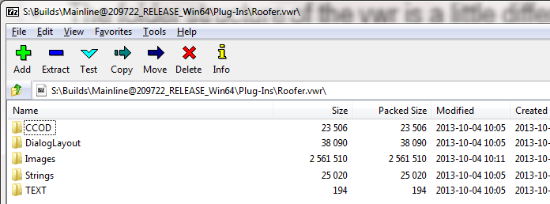
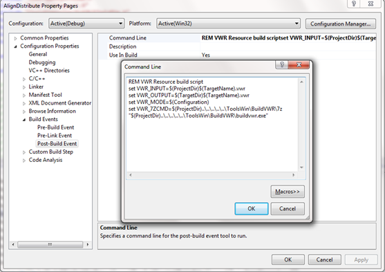
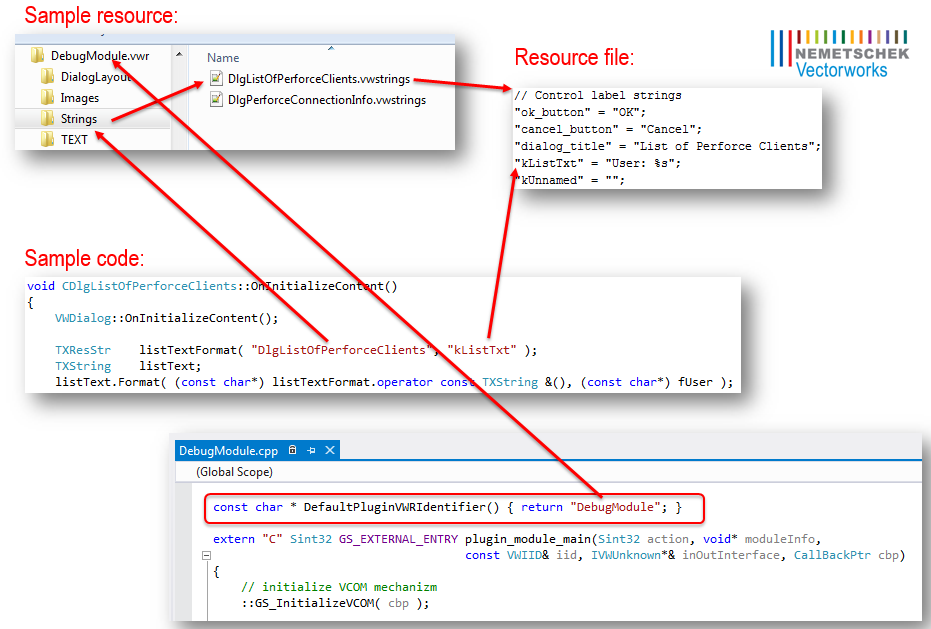

## QTR’s are gone

Mac Resource Manager and QuickTime emulation on Windows not supported in 64-bit.

There is a [QTR Conversion Tool](#) to help developers migrate QTR files into the new VWR files.

## VWR in Vectorworks 2015

We will still have the same vwr files that existed in VW2014, but the format has changed.

The folder structure of the vwr is a little different:
- No “folder inside a folder” any more
  - The vwr file is a folder of resources with the .vwr extension, rather than a zipped file of the resource folder with the .vwr extension.
- Top level of the vwr should now be types
  

Each plug-in now has its own vwr:
- On Windows, the vwr file is stored alongside the plug-in in the same directory (just like the qtr file in VW2014)
- On Macintosh, the vwr folder is stored in the Resources subdirectory of the plug-in bundle (just like the qtr file in VW2014)

VWR should have the same name as the plug-in.

No more resource chain! When resources requests are made in the source code, their location (i.e., which VWR) must be explicit.

## Strings format

The .vwstrings file located in the 'Strings' sub-folder of VWR is an UTF-16 encoded text file containing string resources: "key" = "value";

## SDK

### Compiling with BuildVWR build step

Instead of a custom step to do Rez during build, there is a new tool we provide called BuildVWR. It will report any errors in formatting the strings files, and create the appropriately-formatted VWR file. Source projects must be updated to use this.

The SDK examples have been modified to demonstrate how this works for Mac and Win.



### Resource Functions in ISDK

Resource related functions removed from the [VCOM:VectorWorks:ISDK](#):

- [VCOM:VectorWorks:ISDK::GSCountResources](#)
- [VCOM:VectorWorks:ISDK::GSGetApplicationResFile](#)
- [VCOM:VectorWorks:ISDK::GSGetCurrentResFile](#)
- [VCOM:VectorWorks:ISDK::GSGetIndResource](#)
- [VCOM:VectorWorks:ISDK::GSGetResource](#)
- [VCOM:VectorWorks:ISDK::GSGetResourceName](#)
- [VCOM:VectorWorks:ISDK::GSGetResourceString](#)
- [VCOM:VectorWorks:ISDK::GSReleaseResource](#)
- [VCOM:VectorWorks:ISDK::GSRemoveResource](#)
- [VCOM:VectorWorks:ISDK::GSSetResourceName](#)
- [VCOM:VectorWorks:ISDK::GSUseResFile](#)
- [VCOM:VectorWorks:ISDK::GSWriteResource](#)
- [VCOM:VectorWorks:ISDK::CloseResFile](#)
- [VCOM:VectorWorks:ISDK::OpenExternalResFile](#)
- [VCOM:VectorWorks:ISDK::OpenWorkspaceResFile](#)
- [VCOM:VectorWorks:ISDK::GSGetResourceStringArray](#)
- [VCOM:VectorWorks:ISDK::GetLayoutFromRsrc](#)

New resource related functions in Vectorworks 2015:

- [VCOM:VectorWorks:ISDK::GetVWResourceString](#)
- [VCOM:VectorWorks:ISDK::GetVWResource](#)
- [VCOM:VectorWorks:ISDK::CreateLayoutDialogFromVWResource](#)

The new resource API uses resource identifiers to identify a resource file.

A resource identifier is the path ('/' delimited) to the resource file without extension for the VWR folder and the file.

The resource file name can be specified as full name, or '*' could be used to match arbitrary name.

Example:

```cpp
gSDK->GetVWResourceString(outValue, "Sample Plugin/Strings/11002 My Dialog", "title");
// or identical result can be obtained by:
gSDK->GetVWResourceString(outValue, "Sample Plugin/Strings/11002 *", "title");
```

### TXString changed in 2015

No more resource related functions

- Removed TXString(short strListID, short index) constructor -- use VWResStr instead (see below)
- Removed TXString::Load functions

### SDK 2015 Resource Helper

#### TXResource

This class allows access to any resource in Vectorworks by providing the resource identifier.

Example 1:

```cpp
TXString title = TXResource("Sample Plugin/Strings/DlgSettings", "title");
```

Example 2:

```cpp
TXResource rawResource("Sample Plugin/PNG", "someImage");
memcpy(outBuffer, rawResource.Buffer(), rawResource.Size());
```

#### TXResStr

The TXResStr class is a convenience type intended to standardize the requests for localized strings in a concise way.

It assumes the default vwr contains the file in a "Strings" directory, and that the strings file has extension ".vwstrings".

Example:

```cpp
TXString title = TXResStr("DlgListOfPerforceClients", "kListTxt");
```

This class works by using the 'DefaultPluginVWRIdentifier' global function that must be implemented by each plug-in:



#### TXLegacyResource

There is a helper class for easier migration of VW2014 code. It has constructors for (short/short) identification of string resources, and (short) for binary resources.

Example:

```cpp
TXString title = TXLegacyResource(11000, 5);
```

Note that this class also uses 'DefaultPluginVWRIdentifier' to define the VWR resource root.

#### TXLegacyDialogResource

This class can be used to obtain the resource identifier from old (short) number to be used in the new dialog creation function.

The layout will be searched in the 'DialogLayout' sub-folder of the vwr file.

Example:

```cpp
Sint32 dialogID = gSDK->CreateLayoutDialogFromVWResource(TXLegacyDialogResource(11200));
```

Note that this class also uses 'DefaultPluginVWRIdentifier' to define the VWR resource root. The layout will be searched in the 'DialogLayout' sub-folder of the vwr file.

#### VWDialog

The VWFC::UI::VWDialog base class provides legacy and modern resource creation functions to be used in your 'CreateDialogLayout' override:

- CreateDialogLayoutFromRsrc(short TEXTResourceID)
  - The function will use TXLegacyDialogResource to create the dialog. The layout will be searched in the 'DialogLayout' sub-folder of the vwr file.

- CreateDialogLayoutFromRsrcAndVWR(short TEXTResourceID, const char* defaultVWRName)
  - The function will search for (short) dialog layout inside the specified 'defaultVWRName' vwr file. The layout will be searched in the 'DialogLayout' sub-folder of the vwr file.

- CreateDialogLayoutFromVWR(const char* resIdentifier)
  - The equivalent of the new ISDK function. The layout will be searched in the 'DialogLayout' sub-folder of the vwr file.

## Scripting

- Old functions
  - [VS:SetVSResourceFile](#) -- not doing anything in Vectorworks 2015
  - [VS:GetResourceString](#) -- will return old-style indexed resource from Vectorworks.vwr

- New function
  - [VS:GetVWRString](#)

The new resource API uses resource identifiers to identify a resource file.

A resource identifier is the path ('/' delimited) to the resource file without extension for the VWR folder and the file.

The resource file name can be specified as full name, or '*' could be used to match arbitrary name.

Example:

```vs
{ read a String resource form 'Sample Plugin.vwr' with a key 'title }
GetVWRString(outValue, 'Sample Plugin/Strings/11002 My Dialog', 'title');

{ or identical result can be obtained by: }
GetVWRString(outValue, 'Sample Plugin/Strings/11002 *', 'title');
