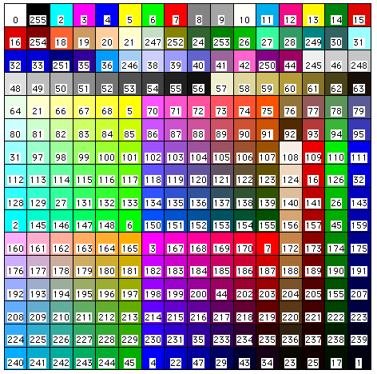

# Appendix E - Miscellaneous Selectors

## Attribute Criteria

| Attribute Type | Selector | Type | Example |
|----------------|----------|------|---------|
| All Objects | ALL | | ALL |
| Descend into Plug-in Objects | INOBJECT | | INOBJECT & (T=RECT) |
| Descend into viewport annotations | INVIEWPORT | | INVIEWPORT & (T=RECT) |
| Descend into Symbols | INSYMBOL | | (T=RECT) & INSYMBOL |
| Do not descend into referenced design layer viewports | NOTINREFDLVP | | NOTINREFDLVP & (T=RECT) |
| Do not descend into non-referenced design layer viewports | NOTINDLVP | | NOTINDLVP & (T=RECT) |
| Attached Record | R | 64 character STRING | R IN ['Part Data'] |
| Class | C | 64 character STRING | C='Class Name-1' |
| Layer | L | 64 character STRING | L='Plan1' |
| Object Type | T | See Object Type table | T=RECT |
| Story | STO | 64 character STRING | STO='Story-1' |
| Object Name | N | 64 character STRING | N='Joe' |
| Symbol Name | S | 64 character STRING | S='Symbol-1' |
| Fill Background | FB | Color index (0 to 255) | FB=34 |
| Fill Foreground | FF | Color index (0 to 255) | FF=56 |
| Fill Pattern | FP | INTEGER | FP=1 |
| Gradient Fill | GFI | 64 character STRING | GFI='Fall' |
| Hatch Fill | HFI | 64 character STRING | HFI='Stipple Dark' |
| Image Fill | IFI | 64 character STRING | IFI='Stones' |
| Tile Fill | TFI | 64 character STRING | TFI='Aggregate-1' |
| Texture | TX | 64 character STRING | TX='Glass Clear' |
| Pen Background | PB | Color index (0 to 255) | PB=128 |
| Pen Foreground | PF | Color index (0 to 255) | PF=256 |
| Pen Pattern / Line Style | PP | INTEGER (patterns 0 to 71) or (dash -1 to -10) | PP=-1 |
| Line Type | LT | 64 character STRING | LT='ISO-02 Dashed' |
| Line Weight | LW | INTEGER | W=20 |
| Opacity | OPA | INTEGER (0 to 100) | OPA=50 |
| Marker Style | AR | INTEGER (see marker constants) | AR=3 |
| Marker Size | ASZ | INTEGER (inches) | ASZ=0.25 |
| Material | MAT | 64 character STRING | MAT='Wood' |
| Sketch Style | SST | 64 character STRING | SST='Rough' |
| Wall Style | WST | 64 character STRING | WST='Wallstyle-1' |
| Slab Style | SLST | 64 character STRING | SLST='Generic-Floor' |
| Roof Style | RST | 64 character STRING | RST='Generic-Roof' |
| Component | COMP | 64 character STRING | COMP='Brick Veneer' |
| Plug-in Style | PST | 64 character STRING | PST='Style-1' |
| Font | FOT | 64 character STRING | FOT='Arial' |
| Font Size | FSZ | INTEGER | FSZ=10 |
| Text Style | TSTY | 64 character STRING | TSTY='Note-12pt' |
| Selected status | SEL | BOOLEAN | SEL=TRUE |
| Visible Selected status | VSEL | BOOLEAN | VSEL=TRUE |
| Visibility Status | V | BOOLEAN | V=TRUE |
| Plane | PLA | 64 character STRING | PLA='Layer Plane' |
| Flipped Status | ISFLIPPED | BOOLEAN | ((S='3680 Door') & (ISFLIPPED)) |
| Location is contained within boundary of a named object | LOC | 64 character STRING | LOC='MyRoom' |

## Fill Patterns

## Color Palette

## SetTool - CallTool Selectors

| Tool | Selector | Tool | Selector |
|------|----------|------|----------|
| 2D Selection Cursor | -240 | Move by Points | -352 |
| 3D Selection Cursor | -349 | Regular Polygon | -225 |
| Pan | -241 | Clipping | -226 |
| Zoom In | -242 | Quarter Arc | -227 |
| Zoom Out | -243 | Center Mark | -228 |
| Text | -200 | Number Stamp | -229 |
| Line | -201 | 3D View Translate | -300 |
| Arc | -202 | 3D View Rotate | -301 |
| Rectangle | -203 | Walkthrough | -302 |
| Polyline | -204 | Flyover | -303 |
| Oval | -205 | Translate Working Plane | -304 |
| Fillet | -206 | Rotate Working Plane | -305 |
| 2D Polygon | -207 | Set Working Plane | -306 |
| Wall | -208 | Move Working Plane | -307 |
| 2D Symbol | -209 | 3D Reshape | -308 |
| Constrained Dimension | -210 | 3D Symbol | -309 |
| Unconstrained Dimension | -211 | Extrude | -310 |
| Radial Dimension | -212 | Slab | -311 |
| Angular Dimension | -213 | Align Plane | -312 |
| 2D Reshape | -214 | 3D Polygon | -313 |
| 2D Rotate | -215 | 3D Mirror | -314 |
| Double Line | -216 | 3D Rotate | -315 |
| Rounded Rectangle | -217 | 3D Locus | -316 |
| Double Line Polygon | -218 | Create Light | -317 |
| Chamfer | -219 | Create Sphere | -319 |
| Freehand | -220 | Create Hemisphere | -320 |
| 2D Locus | -221 | Create Cone | -321 |
| 2D Mirror | -222 | Wall Join | -322 |
| Leader | -223 | Wall Heal | -323 |
| Fill Edit | -341 | Component Join | -340 |
| Rotated Rectangle | -224 | Render Bitmap | -324 |
| NURBS Curve | -325 | Chamfer Edge | -342 |
| NURBS Circle | -328 | Extract Surface | -346 |
| NURBS Arc | -329 | Fillet Edge | -343 |
| Curve Split | -326 | Loft | -344 |
| Connect/Combine | -327 | Project and Trim | -345 |
| Shell Solid | -347 | Create Contours | -348 |
| Analyze Curves or Surfaces | -333 | Protrusion/Cutout | -332 |

## Plug-in Object Parameter Record Field Types

| Field Data Type | Selector |
|-----------------|----------|
| Integer | 1 |
| Boolean | 2 |
| Real | 3 |
| Text | 4 |
| Real - Coordinate Displacement | 7 |
| Text - Popup Menu Item | 8 |
| Text - Radio Button | 9 |
| Real - Coordinate Location X | 10 |
| Real - Coordinate Location Y | 11 |
| Static Text | 14 |
| Text - Class Popup | 18 |
| Text - Layer Popup | 19 |
| Real - Angle | 20 |
| Real - Area | 21 |
| Real - Volume | 22 |
| Text - Class | 23 |
| Text - Material | 24 |
| Text - Fill | 25 |
| Text - Pen Style | 26 |
| Text - Pen Weight | 27 |
| Text - Color | 28 |
| Text - Texture | 29 |
| Text - Symbol | 30 |

## Record - Worksheet Field Types

| Field Data Type | Selector |
|-----------------|----------|
| Integer | 1 |
| Boolean | 2 |
| Number-general | 3 |
| Text | 4 |
| Number-decimal | 5 |
| Number-decimal w/ commas | 6 |
| Number-scientific | 7 |
| Number-fractional | 8 |
| Number-dimension | 9 |
| Number-angle | 10 |
| Number-date/time | 11 |
| Number-dimension area | 14 |
| Number-dimension volume | 15 |
| Number-percentage | 16 |

## Record - Worksheet Field Display Styles

| Field Data Type | Display Style | Selector |
|-----------------|---------------|----------|
| Boolean | TRUE | 1 |
| | FALSE | 2 |
| Number-decimal | no. decimal places | 0 to 9 |
| Number-decimal w/ commas | no. decimal places | 0 to 9 |
| Number-scientific | no. decimal places | 0 to 9 |
| Number-fractional | rounding value | 2,4,8,16,32, etc. |
| Number-angle | degrees | 1 |
| | deg-minutes | 2 |
| | deg-min-seconds | 3 |
| Number-date/time | mdyy | 1 |
| | mdyy hmm | 2 |
| | dmyy | 3 |
| | dmyy hmm | 4 |
| | yymd | 5 |
| | yymd hmm | 6 |
| | d-mmm-y | 7 |
| | d-mmm | 8 |
| | mmm-yy | 9 |
| | h mm | 10 |
| | h mm ss | 11 |
| | h mm(AM/PM) | 12 |
| | h mm ss(AM/PM) | 13 |
| | mdyy hms(AM/PM) | 14 |
| | day month d yyyy | 15 |
| | day month d yyyy hms(AM/PM) | 16 |
| | day mmm d yyyy | 17 |
| | dow mmm d yyyy hms(AM/PM) | 18 |
| | day d month yyyy | 19 |
| | day d month yyyy hms(AM/PM) | 20 |
| | day d mmm yyyy | 21 |
| | dow d mmm yyyy hms(AM/PM) | 22 |
| | dmyy hms(AM/PM) | 23 |
| | day yyyy month d | 24 |
| | day yyyy month d hms(AM/PM) | 25 |
| | dow yyyy mmm d | 26 |
| | dow yyyy mmm d hms(AM/PM) | 27 |
| | yymd hms(AM/PM) | 28 |
| | yyyymmdd | 29 |
| | mmddyyyy | 30 |
| | yyyy-mm-dd | 31 |
| | yyyymmddhhmmss | 32 |
| | ddmmyy | 33 |
| | ddmmyy hms(AM/PM) | 34 |
| | ddmmyyyy | 35 |
| | ddmmyyyy hms(AM/PM) | 36 |
| | yymmdd | 37 |

## LinearDim

**DimType**

| Description | Selector |
|-------------|----------|
| Constrained Horizontal | 0 |
| Constrained Vertical | 1 |
| Horizontal Ordinate | 2 |
| Vertical Ordinate | 3 |
| Unconstrained | 4 |

**arrowFlag**

| Description | Selector |
|-------------|----------|
| Used calculated position | 1 |
| Dim line inside-outside | 2 |
| Start witness ON-OFF | 256 |
| End witness ON-OFF | 512 |

**textFlag**

| Description | Selector |
|-------------|----------|
| Used calculated position | 1 |
| Text inside-outside | 2 |
| Text above dim line | 256 |
| Text aligned to dim line | 512 |
| Force text horizontal | 1024 |

## CircularDim

**DimType**

| Description | Selector |
|-------------|----------|
| Diameter dimension | 0 |
| Other circular dimensions | 1 |

**arrowFlag**

| Description | Selector |
|-------------|----------|
| Used calculated position | 1 |
| Dim line inside-outside | 2 |
| Start witness ON-OFF | 256 |
| End witness ON-OFF | 512 |

**textFlag**

| Description | Selector |
|-------------|----------|
| Used calculated position | 1 |
| Text inside-outside | 2 |
| Text above dim line | 256 |
| Text aligned to dim line | 512 |
| Force text horizontal | 1024 |

## AngularDim

**arrowFlag**

| Description | Selector |
|-------------|----------|
| Used calculated position | 1 |
| Dim line inside-outside | 2 |
| Start witness ON-OFF | 256 |
| End witness ON-OFF | 512 |
| Reference angle | 1024 |
| 2 reference lines | 2048 |

**textFlag**

| Description | Selector |
|-------------|----------|
| Used calculated position | 1 |
| Text inside-outside | 2 |
| Text above dim line | 256 |
| Text aligned to dim line | 512 |
| Force text horizontal | 1024 |
