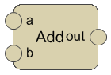
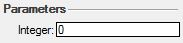
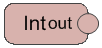
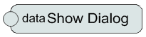
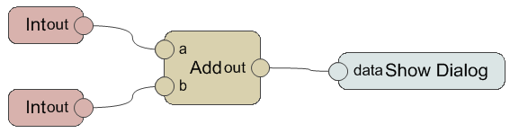
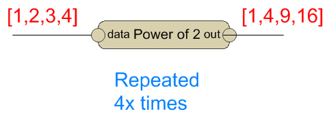
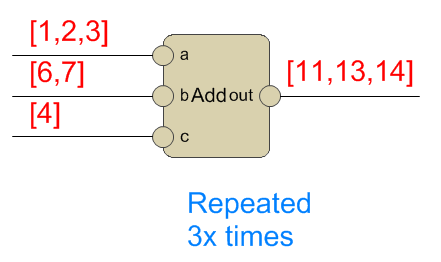
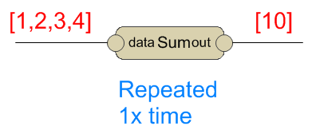
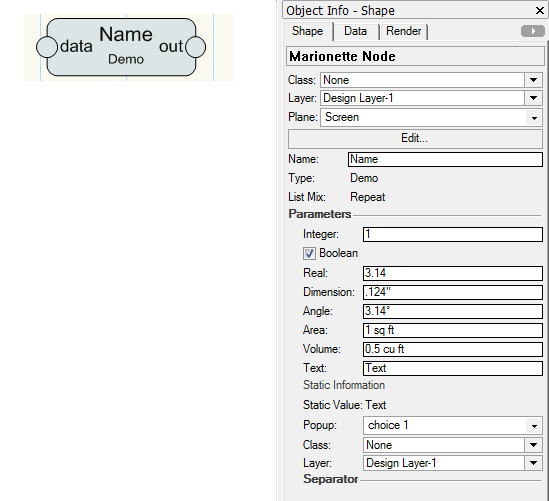

## What is Marionette

Marionette is a graphical programming language for Vectorworks. It allows the user to generate and manipulate VW objects without learning a traditional text-based language. A "Script" or "Program" in Marionette is called a "Network" and resembles a flow-chart. A network is a collection of "Nodes" each of which represents a function or mapping from inputs to outputs. Data travels from left to right in wires between nodes, possibly generating VW drawing or BIM objects in the process.

A series of tutorials on the basics of Marionette can be found [here](https://forum.vectorworks.net/index.php?/articles.html/articles/marionette-tutorials-r432/).

## What is a Node

A node is a single piece of the marionette network. It defines how the data will be transferred from the input ports on the left to the output ports on the right of the node.

This is a simple Marionette Node that adds two input numbers and outputs the result:

* **a** -- the first input port;
* **b** -- the second input port;
* **out** -- the output port with the result;

Nodes might have many or no input and output ports.

Nodes can also have Object Info Palette - Shape Pane (OIP) controls when data is required from the user.

This is an example of a simple node that has no input ports. It represents an integer value which is set in the OIP and sent downstream through the single output port:

And this node only has an input port and then will present a dialog with showing its value:

## What is a Network

A network is a set of Marionette Nodes connected to each other to define the flow of data. The data flow is defined by the wires that connect the input and output ports.

The two 'Int' nodes will collect two numbers, then they will flow into the 'a' and 'b' ports of the 'Add' node, which will produce the sum and put it in the 'out' port. Then this value will flow into the 'data' port of the 'Show Dialog' node.

## Data Flow

The data type that flows on a wire from an output to an input port and is determined by the output. The data might be a single value or a list of values.

### Simple Values

This is a graphical demonstration of a simple value data flow:

The numbers in red represent the actual values that run through the wires.

In this case, each wire transfers only one value from the output ports to the input: 1 + 2 = 3

### Array values

The wires might carry several data values. In this case, the node will be repeated for each value on the wire

There are four values on the input wire. This means the node will be executed for each single value to produce a single result. The result of each iteration will be collected in a list and passed as an output.

In this case, the node will calculate the power of 2 of the value and set it as a result. The result will also be composed of four values:
* 1 ^ 2 = 1
* 2 ^ 2 = 4
* 3 ^ 2 = 9
* 4 ^ 2 = 16

### Mixing Data Flow

There might be several wires coming into a single input port.

Then the data will be combined, so a list of values will be the input for this port. At the same time, the other port receives only one value. This is the case where mixing of values will be performed.

The mixing will be performed when at least one input is a list of values. Then all inputs will be converted to lists of the same size, where the last element of the short lists will be repeated to match the length of the longest.

In the case above, the 'Add' node will be repeated twice:
* 1 + 2 = 3
* 1 + 3 = 4

This result is because, after mixing, the port 'a' will be: \[1,1], and the port 'b' will be: \[2,3]

You can imagine a more complex case:

* port a = \[1,2,3]
* port b = \[6,7]
* port c = \[4]

Then after mixing, the ports will be:
* port a = \[1,2,3]
* port b = \[6,7,7]
* port c = \[4,4,4]

And the node will be repeated three times for:
* 1 + 6 + 4 = 11
* 2 + 7 + 4 = 13
* 3 + 7 + 4 = 14

### Absorbing Data Flow

Some nodes are actually designed to process lists of input data. This behavior will be identified by the node itself.

These nodes will repeat only once and this one run will absorb the entire data, regardless if it is a list of values or a single value.

**Note:** It is not necessary that these nodes to output a list. They might produce a single value, or a list of values. This depends on the behavior of the specific node.

Here is an example of summing node, that will add the input values and output the result as a single value:

## Node Object Info Palette

Nodes can define parameters which are displayed in the Object Info palette - Shape pane. They are displayed after some standard parameters available for the Marionette node objects.

* **Class, Layer, Plane** -- default parameters for all Vectorworks objects, controlling the class, layer, and plane of the selected object;
* **Edit button** -- allows editing the Python script that defines this node. See [Marionette Implement a Node](Implement%20a%20Node.md) for more on this;
* **Description button** -- shows a dialog with the description text for the node. This is a description that the developer of the node provided;
* **Name** -- the name of the node that is displayed on the drawing inside the node. If empty then the node type ('Demo' in the image above) is displayed instead;
* **Type** -- the type of the node. This is fixed text by the node developer, and displayed on the drawing;
* **List Mix** -- the list mixing mode (Repeat or Absorb) for the data flow of the import ports of this node. See [Data Flow](#data-flow) above.
* **Parameters** -- in this section, the node developer will put controls to affect the behavior of the node. This section is differed for the different nodes, and might be missing. The supported control types are (note the names of the controls in the image above is just for demonstration. Each node defines the names of the parameters):
  * Integer -- an integer value
  * Boolean -- a checked/unchecked value
  * Real -- a real value
  * Dimension -- a linear dimension value in the units of the current document
  * Angle -- an angular value in the units of the current document
  * Area -- an area value in the units of the current document
  * Volume -- a volume value in the units of the current document
  * Text -- a text value
  * Static Information -- a text displayed as a single line
  * Static Value -- a text displayed as named parameter value
  * Popup -- a text choice popup
  * Class -- a class choice popup
  * Layer -- a layer choice popup
  * Separator -- this control is used to visually separate different groups of parameters. It has no control behavior for the user

## Executing a Network

When executing the marionette network of nodes, Vectorworks will traverse all the nodes, and the connections between them, and build up a composite Python script from the code of each node. Then Vectorworks will execute that script.

The code for each node can be accessed through the 'Edit...' button on the node object info palette - shape pane.

## Implementing a Node

Implementing a node requires writing a python script that defines the input and output ports, as well as the code that runs when the node is processed as a part of a network.

The article [Marionette Implement a Node](Implement%20a%20Node.md) contains more information.

