# Node Reference

**UNDER CONSTRUCTION**

*Special thanks to user Tui Walker Kamakorewa for his work on this reference.*

## Attributes

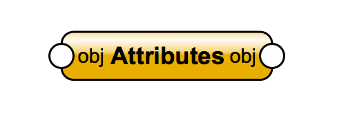

### Common

**Attributes** - Assigns this node's attributes to the input object

### Attributes - Get Operations

**Get Arrow Style** - Returns the arrow style parameters for the indicated object

**Get Object Marker** - Gets all properties for the specified marker of an object

**Get Class** - Returns the class assigned to the referenced object. A string "None" is returned if the object has no class assigned to it

**Get Opacity** - Returns the opacity of an object. Opacity is obtained as percentage value in range \[0, 100]

**Get Description** - Retrieves any description text that exists for a specified object

**Get Entity Matrix** - Returns the matrix of the plane for a planar object

**Get View Matrix** - Returns the view matrix for a layer or viewport object

**Get Opacity By Class** - Determines whether the object is using a class opacity

**Get Fill** - Returns the fill properties of the referenced object

**Get Line Attribute** - Returns the line attributes of the referenced object

**Get Fill Points** - Returns start and axis end points of the fill. Note: only works with 2D objects that have a gradient or image fill

**Get Marker** - Returns marker information of the referenced object

### Attributes - Set Operations

**Set Arrow Style** - Sets the arrow style parameters for the indicated object

**Set Class** - Assigns a class to the referenced object

**Set Description** - Sets the user-supplied description for an object. Adds the description data node if one does not already exist

**Set Entity Matrix** - Sets the matrix of the plane for a planar object. If there is already a plane in the document with that matrix, the object will be set to be in that plane. Otherwise a new plane will be added to the document

**Set Fill** - Sets the fill attributes of the specified object

**Set Fill Color By Class** - Sets the referenced object to use the class attribute fill colors

**Set Fill Pattern By Class** - Sets the referenced object to use the class attribute fill pattern

**Set Line Attribute** - Sets the line attributes of the referenced object

**Set Line Style By Class** - Sets the referenced object to use the class attribute line style

**Set Line Weight By Class** - Sets the referenced object to use the class attribute line weight

**Set Marker** - Specifies marker information for the referenced object - OBSOLETE procedure: Use SetObjBeginningMarker and/or SetObjEndMarker instead.

**Set Marker By Class** - Sets the referenced object to use the class attribute marker style. Sets it so that the class arrow style is used for the referenced object

**Set Object Marker** - Sets all properties of an object's marker

**Set Opacity** - Sets the opacity of the object to the opacity passed in

**Set Opacity By Class** - Sets the specified class to use the class opacity. If you set opacity to an object inside parametric the actual opacity will be combined with the opacity of the parametric object itself

**Set Pen Color By Class** - Sets the referenced object to use the class attribute pen colors

**Set View Matrix** - Sets view matrix for layer or viewport object

**Set Text Style By Class** - Sets the referenced object to use the class text style. To undo this, use SetTextStyleRef on the object

**Thumbnail Preview** - For a given VectorWorks resource (i.e. Hatch, Texture, Symbol/PIO, etc...), this function will create or update its thumbnail preview

### Attributes - Conditionals

**Is Fill Color By Class** - Returns whether class fill colors are used for the referenced object

**Is Fill Pattern By Class** - Returns whether a class fill pattern is used for the referenced object

**Is Line Style By Class** - Returns whether a class line style is used for the referenced object

**Is Line Weight By Class** - Returns whether a class line weight is used for the referenced object

**Is Marker By Class** - Returns whether a class marker style is used for the referenced object

**Is Object Flipped** - Returns the flip orientation of the specified 3D object. This function works for sweeps, extrudes, multiple extrudes, symbols, solids, layer references, and plug-in objects

**Is Pen Color By Class** - Returns whether class pen colors are used for the referenced object

**Is Text Style By Class** - Determines whether the class text style is used for the referenced object

## Classes

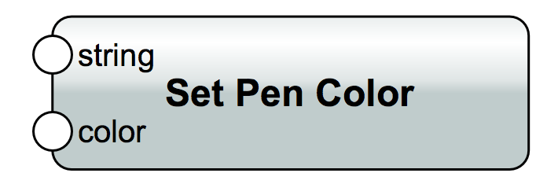

**Set Pen Color** - Sets the pen color of the specified class

**Set Style to Hatch Pattern** - Sets the class fill style to use the specified hatch pattern

**Set Fill Pattern** - Sets the fill pattern of the specified class. To apply a bitmap fill pattern, use a positive value corresponding to the desired fill pattern index. To apply a vector fill, use the negative of the index of the vector fill (index * -1)

**Set Line Style** - Sets the line style of the specified class

**Set Class Opacity** - Sets the opacity percentage of a class. The opacity is specified by percentage value in range \[0, 100]

**Get Class Marker** - Get all properties for the named class marker

**Set Line Weight** - Sets the line weight of the specified class

**Get Class Opacity** - Returns the opacity of the specified class

**Set Text Style Usage** - Controls whether the text style of the specified class is used at object creation

**Get Pen Color** - Returns the pen color setting of the specified class

**Show Class** - Sets the visibility of the specified class to normal (visible) status

**Set Fill Color** - Sets the fill color depending on the selection. Must be an RGB component of desired color. RGB values are in the range of 0-65535

**Set Texture Usage** - Toggles the document setting for using the texture attributes of the specified class at object creation

**Get Text Style** - Returns the text style of the specified class

**Get Class Options** - Returns the class visibility setting for the active document

**Get Visibility Status** - Returns the visibility status of the specified class

**Set Text Style** - Sets the text style of the specified class.

**Gray Class** - Sets the visibility of the specified class to grayed status

**Set Graphic Usage** - Toggles the document setting for using the graphic attributes of the specified class at object creation

**Hide Class** - Sets the class visibility of the specified class to hidden (invisible) status

**Get Fill Color** - Returns the fill background or foreground color setting of the specified class

**Get Class List** - Returns the name of a class at a given index in the document class list. For example, ClassList(4) will return the name of the fourth class in the list

**Is Text Style Used** - Returns whether the text style of the specified class is used at object creation

**Get Fill Pattern** - Returns the fill or hatch pattern of the specified class

**Set Class Options** - Sets class visibility setting for the active document

**Is Graphic Used** - Returns whether the text style of the specified class is used at object creation

**Set Class Marker** - Sets all the properties for the named class marker

**Get Hatch Pattern** - Returns the name of the hatch pattern setting of the specified class. An empty string will be returned if the class does not use a hatch pattern

**Rename Class** - Renames the specified class. All objects assigned to the class being renamed are updated

**Default Opacity** - Sets the document default settings to the opacity of the active class

**Name Class** - Creates a new class in a VectorWorks document, which will then become the active class. If the specified class already exists, then it will become the active class of the document. Note: Class names cannot exceed 63 characters

**Get Line Style** - Returns the line style of the specified class

**Delete Class** - Deletes the specified class from the active document. If there are objects in the class to be deleted, they are reassigned to the "None" class

**Default Fill Color** - Sets the default document fill colors to the fill colors of the active class

**Get Line Weight** - Returns the line weight of the specified class

**Default Line Style** - Sets the default document line style to the line style of the active class

**Get Active Class** - Returns the name of the active class of the document

**Get Class Count** - Returns the total number of classes in the active document

**Default Line Weight** - Sets the default document line weight to the line weight of the active class

**Default Fill Pattern** - Sets the default document fill pattern to the fill pattern of the active class

**Default Pen Color** - Sets the default document pen colors to the pen colors of the active class

## Data Flow

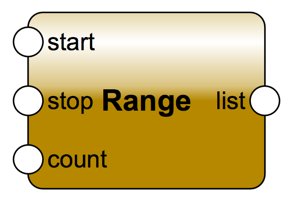

**Remove At** - Removes the item from the input list at the specified index and returns it. If a list of indices is given, the node will do the removal for each index, and a list of removed items will be returned

**Repeat** - Create a list from the input item repeated n times

**Reverse List** - Reverse the items of the list

**Rotate List** - Rotate the items in a list a specified number of times

**Sequence** - Creates a sequence of numbers x: for x = start : while (x < stop) x += step
If not connected:
  start = 0
  stop = 1
  step = 1

**Series** - Creates a series of numbers beginning at start and increasing by step for count cycles
If not connected:
  start = 0
  step = 1
  count = 1

**Set Item** - Sets the element at a specified index in an input list to the input item's value. If lists of items and indices are given, the node will traverse through all the items and do the modifications on the input list

**Slice** - Slices the list from start to end indices, with the specified step count.
If not connected:
  start = 0
  stop = the length of the list
  step = 1

**Slice Set** - Sets the value of the input item to the slice of the list from start to end indices, with the specified step count. This operation will substitute the slice with the specified value. If not connected: 
  start = 0
  stop = the length of the list
  step = 1

**Sort** - Sorts the elements in a list

**Unzip** - Unzips a list alternatively to each output list

**Zip** - Zips 2 lists into 1, alternating between each list

## Debug

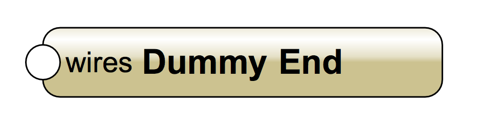

**Dummy End** - This is a dummy node that doesn't do anything. It is used to connect the ends of sub-networks to initiate their execution.

**Test List** - This node will test if the input list length matches the expected length. Optionally it will also test the list contents. If the test fails the node will turn red and an alert dialog will be shown.

**Test List At** - This node will test the value at a specified index within a list. If the values don't match, the node will turn red and an alert dialog will be shown.

**Test Value** - This node will test if the input value matches the expected value. If the values don't match, the node will turn red and an alert dialog will be shown.

## Input

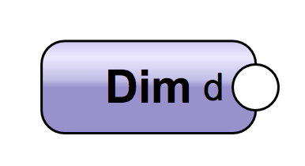

[Input Nodes - In-depth](#)

**Any** - Create any value using the python eval function

**Bool** - Generates a True or False value from a checkbox in the OIP

**Control Geometry** - When used in the definition network of a Marionette Object, returns the first object in the Control Geometry group. Not usable outside of an object

**Dim** - A real value with units

**Int** - An integer value

**Name** - Get a named object in the drawing

**Objs by Crit** - Returns a list of objects meeting the input criteria

**Point2** - This node represents position in 2D space defined in the OIP, optionally with units

**Point3** - This node represents position in 3D space, defined in the OIP

**Real** - A Real value defined in the OIP in document units

**String** - A text string defined in the OIP

**Vec2** - This node produces a 2 dimensional vector

**Vec3** - This node produces a 3 dimensional vector

## Layers

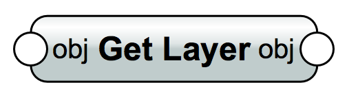

# Layers - Common

**Get Active Layer**  
Returns the current active layer in the document

**Layer**  
Creates a new layer in a VectorWorks document. After creation, the new layer becomes the active layer of the document. If the layer name passed to the procedure already exists, the procedure switches the active layer to the specified layer

**Get Layer**  
Returns the layer of the referenced object

**Layer With Type**  
Creates a layer of the specified type

**Set Layer**  
Adds an object to a specified layer

# Layers - Others

**Get First Layer**  
Returns the first layer object in a VectorWorks document

**Get Last Layer**  
Returns the last layer object in a VectorWorks document

**Get Layer By Name**  
Returns a layer object given its name

**Get Layer Count**  
Returns the current number of layers within the active document

**Get Layer Elevation**  
Gets the elevation and thickness of the specified layer

**Get Layer Name**  
Returns the name of the referenced layer

**Get Layer Visibility**  
Returns the visibility of the referenced layer

**Get Z Values**  
Returns the Z (layer base elevation) and delta Z (layer thickness) values for the active layer

**Get Object Count**  
Returns the number of objects on the referenced layer

**Hide Active Layer**  
Sets the visibility status of the active layer to hidden. Objects on hidden layers will not be viewable from other layers

**Set Z Values**  
Sets the Z (layer base elevation) and delta Z (layer thickness) for the active layer

**Show Active Layer**  
Sets the visibility status of the active layer to visible. Newly created layers always defaulted to the Show mode

# Math

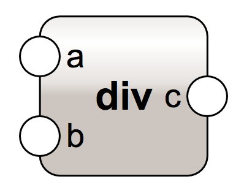

## Math - Basic Math

**div floored**  
Floored division c = a / b

**shift**  
x shifted by n bits. Direction determined by the parameter

**and**  
bitwise and of x and y

**xor**  
bitwise exclusive or of x and y

**or**  
bitwise or of x and y

**round**  
x rounded to n digits, rounding half to even. If n is not connected, it defaults to 0

**max**  
Return the largest number

**min**  
Return the smaller number

**invert**  
the inverted state of x

**float**  
x converted to floating point

**int**  
x converted to integer

**bool**  
x converted to boolean True or False

**abs**  
absolute value of magnitude of x

**negative**  
y = - x

**sub list**  
Subtract all values: out = list\[0] - list\[1] - ...

**mul list**  
Multiply all values: out = list\[0] * list\[1] * ...

**add list**  
Add all values: out = list\[0] + list\[1] + ...

**sub**  
Subtract two numbers: c = a - b

**div**  
Divide two numbers: c = a / b

**mul**  
Multiply two inputs: c = a * b

**add**  
Add two numbers: c = a + b

**less equal**  
b = (x <= y)

**greater equal**  
b = (x >= y)

**greater**  
b = (x > y)

**less**  
b = (x < y)

**not equal**  
b = (x != y)

**equal**  
b = (x == y)

## Math - Linear Algebra

**Normalize**  
Normalizes a Vector

**Matrix Rows**  
Get the matrix (x,y,z) of the specified row

**Matrix Columns**  
Get the matrix (x,y,z,off) of the specified column

**Flip**  
Flip the input matrix

**Invert**  
Returns an inverted matrix of the given matrix.

**Is Identity**  
Checks whether the current matrix is an identity matrix.

**Matrix Rotation**  
Create a new rotation matrix that is used to perform a rotation.

**Matrix Translation**  
Create a new translation matrix that is used to perform a location change (translation).

**Matrix Scale**  
Create a new scale matrix that is used to perform a scale change.

**Is Flipped**  
Checks whether a given matrix is already flipped.

**Rotate XYZ**  
Applies a rotation to the input matrix around the specified axis: X,Y or Z, with the given angle. There are two options of how the rotation is applied to the input matrix: after or before.

**Rotate Round Point**  
Applies a rotation to the input matrix. The rotation is defined by a center point and rotation angles around the three axis.

**Scale After**  
Applies a scaling to the input matrix.

**Scale With Center**  
Applies a scaling to the input matrix (after) with the respect to a given point.

**Transpose**  
Returns the transpose of a matrix. The transpose of a matrix is a new matrix whose rows are the columns of the original. This operation will leave the translation unchanged and only the rotation part of the matrix will be transposed

**Translate**  
Applies a translation to the input matrix. There are two options of how the translation is applied to the input matrix: after or before.

**Inverse Point Transform**  
Inverse transforms the 2D/3D input point with the specified matrix

**Point Transform**  
Transforms the 2D/3D input point with the specified matrix

**Set Matrix**  
Set a matrix row. Set only the values that are connected and return the result matrix

**Matrix**  
Create a matrix

## Math - Number-Theoretic and Representation

**ldexp**  
Return x * (2^i). This is essentially the inverse of function frexp().

**trunc**  
Return the Real value x truncated to an Integral (usually an integer)

**modf**  
Return the fractional and integer parts of x

**isnan**  
Return True if x is a NaN (not a number), and False otherwise

**isinf**  
Return True if x is a positive or negative infinity, and False otherwise.

**isfinite**  
Return True if x is neither an infinity nor a NaN, and False otherwise. (Note that 0.0 is considered finite.)

**frexp**  
Return the mantissa and exponent of x as the pair (m, e). This is used to "pick apart" the internal representation of a float in a portable way

**divmod**  
Return the pair: floor division and mod of x and y 

**mod**  
res = x % y  
Left over after division

**floor**  
Return the floor of x, the largest integer less than or equal to x

**factorial**  
Return x factorial

**abs float**  
Return the absolute value of x. The returned value is a float number

**copysign**  
Return a float with the magnitude (absolute value) of x but the sign specified

**ceil**  
Return the ceiling of x, the smallest integer greater than or equal to x

## Math - Power and Logarithmic

**exp**  
y = e ^ x

**expm1**  
y = e ^ x - 1  
For small reals x, the subtraction can result in a significant loss of precision  
This function provides a way to compute this quantity to full precision

**sqrt**  
Return the square root of x

**pow**  
Return x raised to the power y. Exceptional cases: pow(1.0, x) and pow(x, 0.0) always return 1.0, even when x is a zero or a NaN. If both x and y are finite, x is negative, and y is not an integer then pow(x, y) is undefined, and raises ValueError

**log1p**  
Return the natural logarithm of 1+x (base e). The result is calculated in a way which is accurate for x near zero.

**log10**  
Return the base-10 logarithm of x. This is usually more accurate than log(x, 10).

**log2**  
Return the base-2 logarithm of x. This is usually more accurate than log(x, 2).

**log**  
With one argument, return the natural logarithm of x (to base e).  
With two arguments, return the logarithm of x to the given base, calculated as log(x)/log(base).

## Math - Trigonometric

**atan**  
y = atan(x), where y is in radians

**tan**  
y = tan(x), where x is in radians

**hypot**  
Return the Euclidean norm (i.e. hypotenuse of a right triangle), sqrt(x*x + y*y).

**atan2**  
z = atan2(y, x) = atan(y / x), where z is in radians

**acos**  
y = acos(x), where y is in radians

**cos**  
y = cos(x), where x is in radians

**asin**  
y = asin(x), where y is in radians

**sin**  
y = sin(x), where x is in radians

## Math - Angular Conversion

**Deg2Rad**  
Converts angle x from degrees to radians

**Rad2Deg**  
Converts angle x from radians to degrees

## Math - Hyperbolic

**acosh**  
Return the inverse hyperbolic cosine of x

**cosh**  
Return the hyperbolic cosine of x

**asinh**  
Return the inverse hyperbolic sine of x

**sinh**  
Return the hyperbolic sine of x

**atanh**  
Return the inverse hyperbolic tangent of x

**tanh**  
Return the hyperbolic tangent of x

## Math - Special

**erf**  
Return the error function at x  
This function can be used to compute traditional statistical functions such as the cumulative standard normal distribution:  
phi(x) = (1.0 + erf(x / sqrt(2.0))) / 2.0

**erfc**  
Return the complementary error function at x.  
The complementary error function is defined as 1.0 - erf(x).  
It is used for large values of x where a subtraction from one would cause a loss of significance.

**lgamma**  
Return the natural logarithm of the absolute value of the Gamma function at x

**Random**  
Return a random number between high and low

**gamma**  
Return the Gamma function at x

## Math - Constants

**e**  
The mathematical constant e

**phi**  
The mathematical constant phi, also known as the Golden Ratio

**pi**  
The mathematical constant pi

## Math - Complex Numbers - Conversion Coordinates

**complex get**  
Extracts the real and imaginary parts from the specified complex number

**complex number**  
Creates a complex number with the specified real and imaginary parts

**complex phase**  
Return the phase of x (also known as the argument of x), as a float. phase(x) is equivalent to math.atan2(x.imag, x.real)

**complex polar**  
Return the representation of x in polar coordinates. Returns a pair (r, phi) where r is the modulus of x and phi is the phase of x. polar(x) is equivalent to (abs(x), phase(x))

**complex rect**  
Return the complex number x with polar coordinates r and phi. Equivalent to r * (math.cos(phi) + math.sin(phi)*1j)

**conjugate**  
Return the conjugate of the complex number x

## Math - Complex Numbers - Power and Logarithmic

**complex exp**  
Return the exponential value e^x

**complex log**  
Returns the logarithm of x to the given base. If the base is not specified, returns the natural logarithm of x. There is one branch cut, from 0 along the negative real axis to -8, continuous from above 

**complex log10**  
Return the base-10 logarithm of x. This has the same branch cut as log() 

**complex sqrt**  
Return the square root of x.

## Math - Complex Numbers - Trigonometry

**complex e**  
The mathematical constant e, as a float.

**complex pi**  
The mathematical constant p, as a float.

## Math - Complex Numbers - Classification

**complex isfinite**  
Return True if both the real and imaginary parts of x are finite, and False otherwise.

**complex isinf**  
Return True if either the real or the imaginary part of x is an infinity, and False otherwise.

**complex isnan**  
Return True if either the real or the imaginary part of x is a NaN, and False otherwise.

## Math - Complex Numbers - Constants

**complex e**  
The mathematical constant e, as a float.

**complex pi**  
The mathematical constant p, as a float.

## Math - Complex Numbers - Hyperbolic

**complex acosh**  
Return the hyperbolic arc cosine of x.

**complex asinh**  
Return the hyperbolic arc sine of x.

**complex atanh**  
Return the hyperbolic arc tangent of x.

**complex cosh**  
Return the hyperbolic cosine of x.

**complex sinh**  
Return the hyperbolic sine of x.

**complex tanh**  
Return the hyperbolic tangent of x.

# Object Info
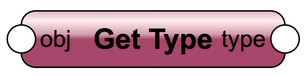

**Get 2D Point**  
Returns the location of the specified vertex of a referenced object

**Get 3D Info**  
Returns the height, width and depth values of the referenced 3D object

**Get 3D Moment Inertia**  
Returns the moments of inertia of a 3D object about the x, y, and z axes of a point at the center of gravity of the object

**Get 3D Orientation**  
Returns the 3D orientation of the referenced object. If the object is mirrored, a reflection across the X-Y plane must be applied before rotating by the angles above in order to reproduce the objects orientation

**Get 3D Product Inertia**  
Returns the products of inertia of a 3D object for the xy, yz, and zx planes passing through a point at the center of gravity of the object

**Get Angle**  
Returns the angle of the referenced line or arc object

**Get Area**  
Returns the area of the referenced object

**Get Bounding Box**  
Returns the bounding box's coordinates of the projection of an object on the screen plane

**Get Gravity Center**  
Returns the center of gravity on a 3D object

**Get Height**  
Returns the height of the referenced object

**Get Length**  
Returns the length of an object

**Get Mesh Vertex**  
Returns the vertex at a given index of a mesh object

**Get Mesh Vertex Count**  
Returns the number of vertices of the passed mesh object

**Get Object Variable**  
Returns the value or the status of a VectorWorks object property

**Get Parent**  
Returns the parent container object of the referenced object

**Get Perimeter**  
Calculates the perimeter of an object

**Get Planar Reference**  
Gets the plane reference ID of the specified object

**Get Symbol Location**  
Returns the insertion point of the referenced symbol or plug-in object

**Get Symbol Rotation**  
Returns the rotation angle (in degrees) of the referenced symbol or plug-in object

**Get Type**  
Returns the type index of the referenced planar or screen object. A complete listing of supported object types may be found in the Appendix

**Surface Area**  
This node calculates the surface area of a solid

**Get Vertex**  
Returns the coordinates of the specified vertex of a referenced mesh, a 3D polygon, or a NURBS curve object

**Get Width**  
Returns the width of the referenced object

**Parent PIO**  
Returns the parent object of this node

**Rotate 3D**  
Rotates the referenced 3D object about a specified 3D point. It works with the following 3D objects: extrude, multiple extrude, sweep, mesh, 3D polygon, solid, CSG solid, group, symbol, plug-in object, NURBS curve, NURBS surface

**Set 3D Info**  
Sets the height, width and depth dimensions of the referenced object

**Set 3D Rotation**  
Sets the rotation (in degrees) of the referenced object to the specified rotations and center. This procedure works on the following 3D objects: extrudes, multiple extrudes, and sweeps

**Set Vertex**  
Sets the position of the specified vertex in the referenced 3D object

**Set Width**  
Sets the width of the passed object

**Volume**  
This node calculates the volume of a solid object

**Set Angle**  
Sets the angle of the passed object

**Set Height**  
Sets the height of the passed object

**Set Mesh Vertex**  
Sets a specified mesh vertex to a new location

**Set Planar Reference**  
Sets the plane reference ID of the specified object

**Set PRefID To Ground**  
Sets the specified object on the ground plane. This node is to be used inside parametric objects to place objects on the local coordinate system's ground of the parametric

# Objects
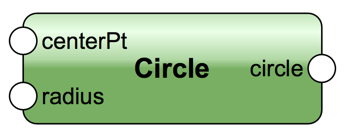

## Objects - Arc

**Arc**  
Creates an arc with the provided input parameters

**Get Arc**  
Returns the parameters of an arc

**Get Arc Distance**  
Returns the distance from the specified point to an arc

**Get Arc Length**  
Returns the length of an arc

**Get Arc Point**  
Calculates and returns a point on an arc. Note, only offset or sweepAngDeg can be specified. If both are specified, only the offset value will be used

**Get Closest Point**  
Returns a point on the specified arc which is the closest to the input point

**Is on Arc**  
Determines, within a tolerance, if a point is on an arc

**Set Arc**  
Sets an arc with the provided input parameters

**Sweep Angle**  
Calculate the sweep angle from where the arc starts to the specified point

## Objects - Circle

**Circle**  
Creates a circle with the provided specifications

**Get Circle**  
Returns the center point and the radius of a circle

**Get Circle Length**  
Returns the length of a circle

**Get Circle Point**  
Calculates and returns a point on a circle. Note, only offset or angle can be specified. If both are specified, only the offset value will be used

**Is on Circle**  
Returns true if the input point lies on the circle. The comparison uses tolerance specified as a parameter of the node

**Set Circle**  
Sets a circle with the provided parameters

## Objects - Line

## Objects - Locus

**Get Location**  
Returns the coordinates of a referenced locus

**Is Locus**  
Determines if an object is a 2D or 3D locus object

**Locus**  
Creates a 2D or a 3D locus object

**Set Location**  
Set the location of a locus object

## Objects - NURBS

### Objects - NURBS - Curve

**Contour**  
Creates contour curves for a solid object

**Curve**  
Creates a NURBS curve from a list of points

**Extend Curve**  
Extends a NURBS curve by a given distance at the start or the end. Returns a handle to the extended curve.The extension can either be linear or can match the curvature of the existing end

**Get Curve Point**  
Returns the point on a NURBS curve at a given knot value in the indexed piece. The index is zero-based (0 to number of knots - 1)The knot value can range from 0 to the value of the last knot in the curve segment

**Get Parameter**  
Returns the parameter of the point obtained by projecting the input point. Also returns the index of the piece in the piecewise NURBS curve on which the projected point lies

**Get Pieces Count**  
Returns the number of pieces that compose the referenced NURBS curve

**Get Segment Type**  
Returns the curve type of a segment of the referenced NURBS curve. The index is zero-based (0 to number of segments - 1). The return value is a boolean value indicating whether the curve is created by fit points (True) or by control poin

**Points on Curve**  
Returns point(s), parametric parameter(s), and curve index(es) at the specified location(s) along a NURBS Curve. Note: location's value must be between 0 and 1

### Objects - NURBS - Surface

**Extend Surface**  
Extends a NURBS surface by a given distance from the start or the end of the surface, in the U direction or V direction

**Get Surface Point**  
Returns the point on a NURBS surface at the given direction. The parameter values can range from 0 to the value of the last knot in each direction

**Grid on Surface**  
Returns a (U x V) grid of 3D points on a NURBS surface

**Interpolated Surface**  
Creates a 3D interpolated surface from an existing NURBS surface with the specified degrees and number of interpolation points. If no surface is provided, a planar rectangular surface will be created

**Surface From Curves**  
Creates a NURBS surface from a network of selected intersecting curves in the document

**Revolve With Rail**  
Creates a NURBS surface or a group of surfaces by revolving a profile about an axis and following a rail guide curve on a plane perpendicular to the plane containing the axis and the profile

**Point on Surface**  
This node returns a 3D point and the normal vector computed at that point on the surface given the direction

**Loft Surface**  
Creates a surface by lofting a group of curves. The NURBS curves are lofted in the order in which they were added to the group

**Shell**  
Creates a shell from a surface. Positive thickness is in the direction of the surface's normal vector

**Surface**  
Creates a NURBS surface from a list of points

**Trim**  
Trims the NURBS surface by a given NURBS curve

### Objects - NURBS - Operation

**Delete Point**  
Deletes a point in the referenced NURBS curve or surface

**Convert to NURBS**  
Converts the input object into a new NURBS object or a group of NURBS objects in the document

**Divide Curve**  
Returns a list of 3D points along a NURBS curve. The points split up the curve into segments of equal length

**Get Degree**  
Returns the degree of a segment in a NURBS curve or surface

**Get Distance**  
Returns the distance from the input point to a NURBS object

**Get Knot**  
Returns the specified knot in a NURBS curve or surface

**Get Knot Count**  
Returns the number of knots for the referenced NURBS curve or surface

**Get Point**  
Returns the coordinates of a point in the referenced NURBS curve or surface

**Get Point Count**  
Returns the number of (control) points for segment of the referenced NURBS curve, or the number of (control) points of the referenced NURBS surface in the U or V direction

**Get Weight**  
Returns the weight of a point in a NURBS curve or surface

**Offset Nurbs**  
Creates a NURBS object that is offset from the original one by an offset distance

**Set Knot**  
Sets the specified knot in a NURBS curve or surface to the input know value

**Set Point**  
Sets the coordinates of a point in the referenced NURBS curve or surface to the input point

**Set Weight**  
Sets the weight of a point in a NURBS curve or surface to the input weight

## Objects - Oval

**Get Oval**  
Returns an oval's height and width

**Get Oval Length**  
Returns the length of an oval

**Oval**  
Creates an oval with the provided parameters

**Quarter Arc**  
Creates a quarter arc with the provided parameters. Width and Height support negative values to allow quarter arc creation in all quadrants

**Set Oval**  
Sets an oval with the provided parameters

## Objects - Poly2D

**Add 2D Vertex**  
Append a vertex to a poly. If the new vertex is an arc vertex, a radius value is required

**Change Vertex Type**  
Change the type of a vertex at a given index to the specified type. If the vertex is not an arc vertex, the radius value is not required

**Clean Up Poly**  
Removes all the same points, within a tolerance, in a poly

**Convert to Arc Polyline**  
Convert, within a tolerance, the input polygon into an polyline that uses arcs for the curves

**Convert To Polygon**  
Polygonizes the input object to produce vertex only polygon

**Get 2D Vertex**  
Returns the vertex at the given index in the  polyl's vertex array

**Get 2D Vertex Count**  
Returns the number of vertices of the input poly

**Get Arc Vertex Radius**  
Return the radius of the specified arc vertex at the given index in the poly's vertex array

**Get Point On Poly**  
Returns a point at the specified distance along the poly starting from the first vertex of the poly, and a vector tangent to the poly at that point

**Get Point In Poly**  
Finds a point inside a polyline

**Is Clockwise 2D**  
Returns true if the poly is clockwise oriented

**Is Closed 2D**  
Returns true if the poly is closed

**Is In or On Poly**  
Returns True if the specified point lies within, or on, the referenced polygon or polyline object and also returns the point

**Regular Polygon**  
Creates a n-sided polygon

**Reverse 2D**  
Reverse the order of the vertices of a poly (CW to CCW or CCW to CW)

**Set All Vertices Visible**  
Set all vertices of a poly to be visible or invisible

**Set Closed 2D**  
Set the poly to be closed or open

**Convert to Polyline**  
Converts any enclosed shape (circle, rectangle, ellipse, etc.) into a polygon or polyline. It does not polygonalize

**Get 2D Area**  
Calculates the area of a poly. The area is positive if the poly is counterclockwise oriented, negative if clockwise

**Get 2D Distance**  
Returns the distance between two vertices of a poly

**Get 2D Edge**  
Returns a poly's edge starting from a given index. If the index is the last index of the poly's vertex array, the end point of the edge will be the first vertex in the poly's vertex array. An edge here can be an arc, a straight line, etc.

**Get 2D Perimeter**  
Calculates the perimeter of a poly (sum of distances between the vertices)

**Has NonCorner Vertex**  
Returns true if the poly has at least one non-corner vertex

**Insert Vertex**  
Insert a vertex to the vertex array of the poly at a given index. If the new vertex is not an arc vertex, a radius value is not required

**Inverse Transform 2D**  
Inverse transform the polygon's points with the specified matrix

**Is Vertex Type**  
Returns true if the type of a vertex at a given index is the same as the specified type

**Is Vertex Visible**  
Returns true if a vertex is visible, given its index

**Offset Poly**  
Calculates an offset poly outside or inside of the input poly

**Polygon 2D**  
Creates a new 2D polygon with the specified vertices

**Set 2D Polygon**  
Set the input polygon to the specified vertices

**Set 2D Vertex**  
Set the vertex at a given index to a specified point

**Set Vertex Visible**  
Set the vertex's visibility

**Transform 2D**  
Transform the polygon/polyline with the specified matrix

# Objects - Poly3D

### Add 3D Vertex
Appends a vertex to a 3D polygon's vertex array

### Clean Up
Removes all the same points (within a tolerance) in a 3D polygon

### Convert to 3D Polys
Converts an object to a group of 3D polygon(s). This node successfully converts rectangles, circles, arcs, polylines, polygons, ovals, lines, straight walls, curved walls, extrusions, and roofs

### Get 3D Area
Calculates the area of a 3D polygon. The area is positive if the polygon's vertices are listed in counterclockwise direction, negative if clockwise

### Get 3D Edge
Returns an edge of a 3D polygon, given its start point index. If the start point is the last vertex of the polygon, the edge's end point would be the first vertex of the polygon

### Get 3D Perimeter
Calculates the perimeter of a 3D polygon, which is the sum of each side's length

### Get 3D Vertex
Returns a 3D polygon's vertex given its index in the polygon's vertex array

### Get 3D Vertex Count
Returns the number of vertices of a 3D polygon

### Get Center
Returns the geometry center of a 3D polygon

### Get X Bounds
Returns the bounds of a 3D polygon on the x-axis

### Get Y Bounds
Returns the bounds of a 3D polygon on the y-axis

### Get Z Bounds
Returns the bounds of a 3D polygon on the z-axis

### Inverse Transform 3D
Applies an inverse transformation to a 3D polygon's vertices using a matrix

### Is Flat
Determines if all vertices of a 3D polygon lie on the same plane

### Polygon 3D
Creates a new 3D polygon with the specified vertices

### Reverse 3D
Reverses the order of a 3D polygon's vertices (CW to CCW or CCW to CW)

### Set 3D Polygon
Sets a 3D polygon to the specified vertices

### Set 3D Vertex
Set a vertex of a 3D polygon at a given index to a specified point

### Transform 3D
Applies a transformation to vertices of a 3D polygon using a matrix

### Set Closed 3D
Sets a 3D polygon to be closed or open

# Objects - Rectangle

### Get Rectangle
Returns the height, width, and origin of a rectangle

### Rectangle
Creates a rectangle with the provided specifications

### Is Rectangle
Determines if an object is a rectangle

### Set Rectangle
Adjusts the height, width, and origin of a rectangle

# Objects - Solid

### Cone
This node creates a 3D solid cone

### Extrude
Extrudes a 2D profile from a bottom Z value to a top Z value

### Flip 3D
Flips the 3D object either horizontally or vertically. The supported types are: Extrude, Sweep, MultiExtrude, Symbol, Mesh and Solid Operations

### Hemisphere
This node creates a 3D solid hemisphere

### Image Prop
Creates an image prop object

### Linear Extrude
This node will extrude a profile from start to end in 3D.

### Mesh to Group
Converts a mesh object to a group of 3D polygons.

### Mesh
Creates a mesh object for each list of 3D polygons provided

### Multiple Extrude
Creates an extrude object from 2 or more 2D profiles. An extrude is created for each list of profiles provided

### Path Extrude
Extrudes a profile along a path

### Solid Boolean
This node performs a boolean operation between lists of objects. The operation will be performed for each possible combination of objects in the lists supplied.

### Sphere
This node creates a 3D solid sphere

### Sweep Object
Creates a 3D sweep object. A sweep object is a 2D profile which has been rotated about a specified point to create a 3D object.

### Tapered Extrude
Creates an extrude with tapered sides

# Objects - Text

### Convert to Poly Group
Converts a text object into a group of poly objects with similar shape.

### Get Char Properties
Returns the properties of the character at a specified position in the text object

### Get Font List Size
Returns the number of available fonts on the local system.

### Get Font Name
Converts a system font ID to a font name.

### Get String
Returns the string contained within the referenced text object.

### Get Style Ref
Returns the style ref properties of the character at a specified position in the text object

### Get Text Length
Returns the string length of the referenced text object.

### Get Text Orientation
Returns the position and orientation attributes of the referenced text object.

### Get Text Properties
Returns the properties of a text object.

### Get Text Width
Returns the margin width of the referenced text object. For wrapped blocks, the margin width is that set by the user. For unwrapped blocks, it is computed by VW to be the width of the longest line.

### Set Char Properties
Sets the properties of the characters within the specified range in the text object

### Set String
Sets the content of the referenced text object. The new text is assigned the font, size and style characteristics of the first character of the old text string.

### Set Style Ref
Sets the style ref properties of the characters within the specified range in the text object

### Set Text Adorner
Creates a relationship between the specified text and the text adorner object such that when the text is scaled in a VP, the text adorner is also scaled.
Several objects can be adorned to the same text object.

### Set Text Orientation
Sets the position and orientation attributes of the referenced text object.

### Set Text Properties
Sets the properties of a text object.

### Set Text Width
Sets the text wrapping margin width of the referenced text object. Automatically activates text wrapping.

### Text
Creates a new text object.

# Operations
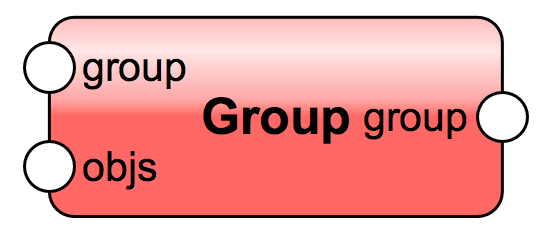

### Contents
Returns the objects contained in a container like object. Supported container types include: Group, Layer, Mesh, Extrude, MultiExtrude, Sweep, Symbol Definition, Folder, Parametric Object, Data Node, Roof

### Convert to Mesh
Converts a group of 3D polygons into a mesh network.

### Copy
Makes a single copy of an object

### Delete
Deletes an object. Note: Objects to be deleted are saved in a list and are deleted at the end of the network execution. So, there is no risk of referencing an object that no longer exists

### Duplicate Object
Creates num duplicates of an object

### Group
This node adds objects to an existing group. If no group is supplied, a new one is created.

### Move
This node will move an object or point by an offset in 2D or 3D. If the object is planar this node does not move it outside of it's plane.

### Orient
This node sets the Z axis of a 3D object.

### Planar Boolean
This node performs a boolean operation between lists of objects. The operation will be performed for each possible combination of objects in the lists supplied.

### Rotate
This node will rotate a 2D or 3D object around "center" if provided. If not provided the object will be rotated about it's center 

### Scale
This node will scale an object or vector

### Transform2
This node will transform a 2D object or 2D vector

### Set Plane
This node will set the reference plane for 2D objects

### Ungroup
Decomposes the reference group into component objects.

# Points
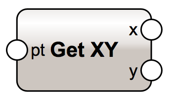

### Distance
Calculates the distance between 2 points

### Get XY
Return the x,y components of a point or vector

### Get XYZ
Return the x,y,z components of a point or vector

### Get XYZOff
Return the x,y,z components of a point and it's offset from the origin

### Highest
Return only the highest of points in a list at the same x,y location

### Lowest
Return only the lowest of points in a list at the same x,y location

### Point 2D
Create a 2D point from x,y values

### Point 3D
Create a 3D point from x,y,z values

### Project
Projects 2D points onto a planar object in 3D space

# Records & IFC

### Attach Existing Record
Attaches an instance of an existing record format to an object

### Choice Item
This creates an OIP Choice Item of simple IFC object types

### Create Field
Creates a field in a record format definition. If the format doesn't exist, it creates the format as well

### Get IFC Entity
Returns the name of the IFC entity attached to the incoming object

### Get IFC Property
Returns a specified standard IFC property and its type

### Get IFC pSet Value
Returns the value and type of a specified IFC pSet field. If the pSet is invalid or not attached, it returns false

### Get Record Field
Returns the value of a data record field. If the data record does not exist or is not attached, it returns false

### Set IFC Entity
Creates and attaches to inbound object an IFC Record with the given IFC entity

### Set IFC Property
Creates and attaches to inbound object a standard IFC property

### Set IFC pSet Value
Sets an IFC pSet property value. If the pSet is not attached, attaches the specified IFC pSet also

### Set Record Field
Sets the value of a data record field. If the data record exists but is not attached, it attaches an instance of the record format to an object prior to setting. Does nothing and returns False if the field name is bad or if the record do

# String
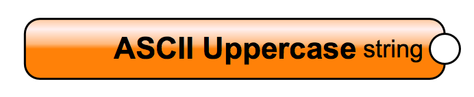

### ASCII Letters
Returns a string that is the concatenation of the ascii_lowercase and ascii_uppercase constants. This value is not locale-dependent

### ASCII Lowercase
Returns the string with the lowercase letters 'abcdefghijklmnopqrstuvwxyz'. This value is not locale-dependent and will not change

### ASCII Uppercase
Returns the string with the uppercase letters 'ABCDEFGHIJKLMNOPQRSTUVWXYZ'. This value is not locale-dependent and will not change

### Digits
Returns the string '0123456789'

### Format
Resulting string is a result from the format string and the arguments. This node uses python formatting:
https://docs.python.org/3.3/library/string.html#format-string-syntax

### Hex Digits
Returns the string '0123456789abcdefABCDEF'

### Oct Digits
Returns the string '01234567'

### Punctuation
Returns a string of ASCII characters which are considered punctuation characters in the current locale

### Str
Create a string from any input. If a list is converted to a string, then you can provide delimiter string

### White Space
Returns a string containing all ASCII characters that are considered whitespace. This includes the characters space, tab, linefeed, return, formfeed, and vertical tab

# Textures
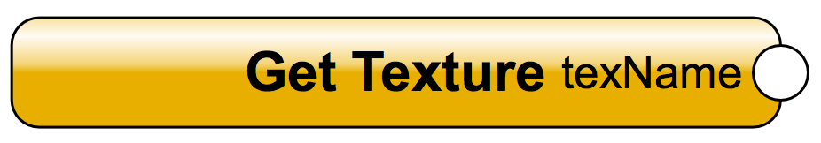

## Textures - Common

### Apply Texture
Apply the given texture to the specified object

### Get Texture
Returns the selected texture from the dropdown list

### Texture
Apply the given texture to the specified object

### Texture Part ID
Returns the ID of the specified object's texture type

## Textures - Get Operations

### Get Class Texture
Return a texture given a class name

### Get Class Use Texture
Returns whether the classes' texture attributes will be used at object creation

### Get Image Cropper
Returns the crop of a cropped image

### Get Shader Record
Returns the shader record of the specified family, if one is attached to the texture

### Get TexBmp
Returns the bitmap object attached to the referenced shader record. If there is no texture applied to an object, the function returns nothing

### Get TexBmp Property
Returns the properties of the referenced texture bitmap

### Get Texture Layer Count
Returns number of texture layers (base + decals) for the specified part of an object

### Get Texture Map
Get map info for a specific part of an object

### Get Texture Reference
Returns the texture reference of a specified object

### Get Texture Set
Returns the texture set of an object

### Get Texture Shader
Returns the LightWorks internal property reference ID for the shader attached to the referenced texture

### Get Texture Shininess
Returns the shininess value of the referenced texture

### Get Texture Size
Returns the texture size in real-world inches

### Get Texture Space
Returns a handle to the texture space attached to the referenced object (or object part). Note: Walls may have three texture spaces attached to them if they have expanded textures

### Get Transparency
Returns the degree of transparency applied to the referenced texture

### Get Wall Hole
Returns the wall texture part of an object in the wall hole group of a symbol definition or plug-in object

## Textures - Set Operations

### Default Texture Map
Sets the object to have default texture mapping info

### Default Texture Space
Sets the texture space for the referenced object to the VectorWorks object defaults

### Set Class Texture
Sets the wall center texture of the specified class

### Set Image Crop Visible
Sets the image crop visibility

### Set Image Cropper
Sets a crop object to an image

### Set TexBmp
Sets the bitmap object attached to the referenced texture. If no texture is desired then do nothing

### Set TexBmp Property
Sets the properties of the referenced texture bitmap

### Set Texture Expanded
Sets the "expanded" state of the referenced objects' texture. When a texture is expanded, different components of an object can have different textures

### Set Texture Map
Set map info for specific part of object

### Set Texture Reference
Sets the texture reference for a specified object

### Set Texture Set
Sets the texture set of an object

### Set Texture Shader
Sets the LightWorks internal property reference ID for the shader attached to the referenced texture

### Set Texture Shininess
Sets the shininess value of the referenced texture. The value is expressed as a percentage value in a range of 0-100 with 0 equaling "Dull".

### Set Texture Size
Sets the texture size in real-world inches

### Set Transparency
Sets the degree of transparency applied to the referenced texture

### Set Wall Hole
Sets the wall texture part of an object in the wall hole group of a symbol definition or plug-in object. This is the wall texture part given to faces of the wall that are created by cutting a hole in the wall with the object

## Textures - Conditionals

### Is Image Crop Visible
Check if the crop of the image is visible

### Is Image Cropped
Check if the given image is cropped

### Is RndrWrks Available
Indicates whether RenderWorks is available

### Is Texture Expanded
Returns whether the referenced object's texture have been "expanded". When a texture is expanded, different components of an object can have different textures

### Is Textureable Object
Determines whether the referenced object supports texture mapping

## Textures - Other Operations

### Attach Texture Space
Deletes any pre-existing space attached to the referenced object (with the specified part ID) and creates a new texture space with the default value for this type of object and attaches it to the object

### Create Paint From Image
Creates a paint node from an image resource on the specified location and rotation. A bitmap (paint) object is created on drawing

### Create Shader Record
Creates a shader record of the desired family and prototype

### Create Texture
Creates a new texture object with default values

### Create Texture Bitmap
Creates a texture bitmap object for the chosen shader record. Brings up dialog to choose the image file. Returns nil if user clicked Cancel or if the shader is not an image-based shader

### Delete Texture Space
Deletes the texture space attached to the referenced object or object part. To render textures correctly, an object must have both a non-zero texture ref and a texture space attached

### Edit Shader Record
Brings up the edit shader dialog for this shader

### Edit Texture
Opens the Edit Texture dialog for the referenced texture

### Edit Texure Bitmap
Opens the Edit Texture Bitmap dialog box to the referenced texture bitmap

### EdSh Construct Layout
Creates a dialog layout for editing a shader's parameter values

### EdSh Populate Menu
Adds menu items to a popup in an edit shader dialog

### EdSh Run Dialog
Runs an edit shader dialog layout
