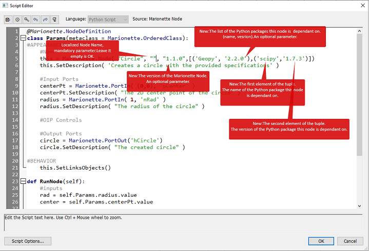

| Package | Package Version | Package OS | VW Version Python Version |
|---------|-----------------|------------|---------------------------|
| numpy-1.22.1-cp39-cp39-win_amd64 | 1.22.1 | Windows | 2025/3.9.2 |
| numpy-1.22.1-cp39-cp39-macosx_10_9_x86_64 | 1.22.1 | MacOS X X86_64 | 2025/3.9.2 |
| numpy-1.22.1-cp39-cp39-macosx_11_0_arm64 | 1.22.1 | MacOS X M1 | 2025/3.9.2 |
| scipy-1.8.0-cp39-cp39-win_amd64 | 1.8.0 | Windows | 2025/3.9.2 |
| scipy-1.8.0-cp39-cp39-macosx_10_9_x86_64 | 1.8.0 | MacOS X X86_64 | 2025/3.9.2 |
| scipy-1.8.0-cp39-cp39-macosx_12_0_arm64 | 1.8.0 | MacOS X M1 | 2025/3.9.2 |
| geopy-2.2.0-py3-none-any | 2.2.0 | Windows | 2025/3.9.2 |
| geopy-2.2.0-py3-none-any | 2.2.0 | MacOS X X86_64 | 2025/3.9.2 |
| geopy-2.2.0-py3-none-any | 2.2.0 | MacOS X M1 | 2025/3.9.2 |
| Pillow-9.0.0-cp39-cp39-win_amd64 | 9.0.0 | Windows | 2025/3.9.2 |
| Pillow-9.0.0-cp39-cp39-macosx_10_10_x86_64 | 9.0.0 | MacOS X X86_64 | 2025/3.9.2 |
| Pillow-9.0.0-cp39-cp39-macosx_11_0_arm64 | 9.0.0 | MacOS X M1 | 2025/3.9.2 |
| plotly-5.5.0-py2.py3-none-any | 5.5.0 | Windows | 2025/3.9.2 |
| plotly-5.5.0-py2.py3-none-any | 5.5.0 | MacOS X X86_64 | 2025/3.9.2 |
| plotly-5.5.0-py2.py3-none-any | 5.5.0 | MacOS X M1 | 2025/3.9.2 |
| pandas-1.4.1-cp39-cp39-win_amd64 | 1.4.1 | Windows | 2025/3.9.2 |
| pandas-1.4.1-cp39-cp39-macosx_10_9_x86_64 | 1.4.1 | MacOS X X86_64 | 2025/3.9.2 |
| pandas-1.4.1-cp39-cp39-macosx_11_0_arm64 | 1.4.1 | MacOS X M1 | 2025/3.9.2 |
| matplotlib-3.5.1-cp39-cp39-win_amd64 | 3.5.1 | Windows | 2025/3.9.2 |
| matplotlib-3.5.1-cp39-cp39-macosx_10_9_x86_64 | 3.5.1 | MacOS X X86_64 | 2025/3.9.2 |
| matplotlib-3.5.1-cp39-cp39-macosx_11_0_arm64 | 3.5.1 | MacOS X M1 | 2025/3.9.2 |
| shapely-2.0.4-cp39-cp39-win_amd64.whl | 2.0.4 | Windows | 2025/3.9.2 |
| shapely-2.0.4-cp39-cp39-macosx_10_9_universal2.whl | 2.0.4 | MacOS X M1 | 2025/3.9.2 |

## Description of the Marionette Node changes

## The Description of the upload process
The user request should contain the Marionette Node name (optional), Marionette Node version (optional), 
the name of the Python package, the version of the Python package, and the version of the python interpreter. 
In order to send an upload request please send an e-mail with the information above to the Marionette team at **klalkovski@vectorworks.net**.

