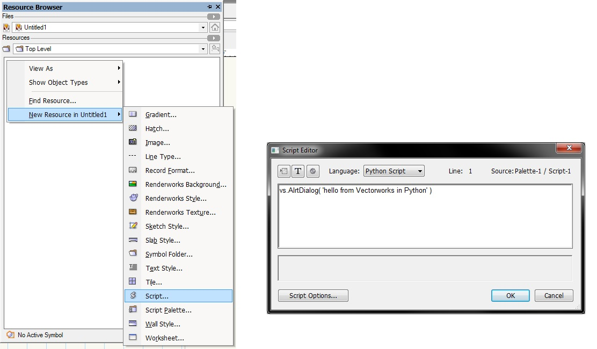

## What is Python

Python is a programming language that lets you work more quickly and integrate your systems more effectively. You can learn to use Python and see almost immediate gains in productivity and lower maintenance costs. [As described on the Python official website](http://www.python.org)

Also, here is the article about Python in [Wikipedia](http://en.wikipedia.org/wiki/Python_(programming_language))

More about Python can be found on the [Python website](http://www.python.org/).

## Python Version

Python has two public versions Python 2.7 and Python 3.x.

Vectorworks uses Python 3 language. This is very important when learning about the language and when writing code.

> Vectorworks uses Python 3.3 at the moment, which is for VW2015. Keep this in mind, as Python adds new stuff in minor releases like enums in 3.4.

## How to start with Python

First of all, you must learn the Python 3 language. The best place to start is the [Python documentation page](http://www.python.org/doc/).

The fastest way to learn the language is to read through [Python Tutorial pages](http://docs.python.org/3/tutorial/).

A very good guide at writing good code and performing common tasks can be found at [The Hitchhiker’s Guide to Python!](http://docs.python-guide.org/en/latest/)

## Python 3 and Vectorworks

Scripting in Vectorworks with Python is very similar to the way [VectorScript](../VectorScript/README.md) works in the software. All the existing APIs are available in the Python scripts inside the 'vs' namespace. Of course, all of the power of the Python engine is available, so that Python style type inference, classes, iterators, libraries, dictionaries, modules, packages, sequence types like lists, tuples, and ranges are available in the Vectorworks environment.

To get started, here is a simple script in Python that displays an alert dialog:

1. Right-click on the resource browser and create a new script
2. Choose language for the script to be 'Python'
3. Type the script

When executed with a double-click on the script label in the resource browser, the alert dialog will be displayed.

## Python API

Full functional reference to the Python Vectorworks API can be found on this page [Function Reference](../Function%20Reference/README.md).

## Samples

These are some introductory samples that demonstrate plug-ins for Vectorworks written in Python. They are with increasing difficulty and demonstrate different aspects in the plug-in development under Vectorworks:

* [Sample menu command](pages/Python%20Sample%20Menu%20Command.md)
* [Sample point object](pages/Python%20Sample%20Point%20Object.md)
* [Sample more complex point object](pages/Python%20Sample%20Point%20Object%20(complex).md)
* [Sample 2D path object](pages/Python%20Sample%202D%20Path%20Object.md)
* [An object that displays an image from the web](pages/Python%20Sample%20WebLinkImage.md)
* [Sample of a menu and two objects](pages/Python%20Sample%20Menu%20with%20Two%20Objects.md)
* [Sample that imports a folder of .png images as symbols](pages/Python%20Sample%20Import%20Images%20as%20Symbols.md)
* [Sample scripts to elevation information of VW objects](pages/Python%20sample%20to%20Import%20elevation.md)

## IDE and Debugging Python Scripts

Often users would use external IDE to edit the Python scripts that Vectorworks executes. Modern IDEs provide intelli-sense information (information about the semantics of the code while typing). To help intelli-sense for Vectorworks Python script APIs, you can point your IDE to the file [vs.py (python file)](pages/files/vs.py) (download, and place it appropriately so the IDE could find it). This file is available in the Include folder of the SDK distribution. This way the IDE will know all Vectorworks Python functions and it would provide some information on the parameters and the behavior of the function. Note that those functions are empty and will not do anything if executed.

It is possible to debug Python scripts in Vectorworks using a third-party application.

See [Python Debugging](pages/Python%20Debugging.md) for more information.

List of some good IDEs:
* [Aptana Studio 3](http://www.aptana.com/products/studio3/download.html) (Free)
* [PyCharm](http://www.jetbrains.com/pycharm/) (Free community edition, Paid full version)

## See Also

* [Scripting Common Tasks](../Common/README.md#common-tasks)
* [Installing Scripts](../Common/README.md#partner-install)
* [List of Python tutorials for non-programmers](https://wiki.python.org/moin/BeginnersGuide/NonProgrammers)
* [List of Python tutorials for programmers](https://wiki.python.org/moin/BeginnersGuide/Programmers)

## Notes
