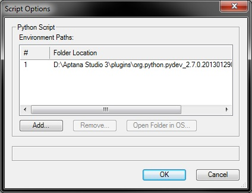
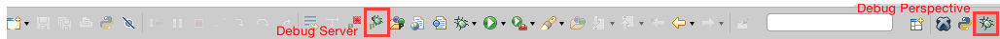

Python is open source scripting engine and there are many free and paid IDEs that can hook into the engine and debug. I guess you can search and experiment with what is out there in the internet. Maybe you can find an easier way to make it work.

## Debugging with Aptana Studio

I have experimented with [Aptana Studio](http://www.aptana.com) which is a version of [Eclipse](http://en.wikipedia.org/wiki/Eclipse_(software)).

Aptana is an IDE that allows you to manage Python projects and can debug remote python engines like Vectorworks. It includes [PyDev](http://pydev.org/) for that which, by itself, is a plug-in to do python in Eclipse.

Anyway, you can remote debug, and here is how:
[http://pydev.org/manual_adv_remote_debugger.html](http://pydev.org/manual_adv_remote_debugger.html)

## Set up Aptana

1. Install Python 3.3 runtime ([download](http://www.python.org/download/)) I’ll hook Aptana to this version later. This is technically not necessary, but I prefer to have it so Aptana could report syntax errors while editing.
2. Install Aptana Studio 3 ([download](http://www.aptana.com/products/studio3/download.html)).
3. Aptana supports many languages. Only the first time, you must setup the Python interpreter (the above mentioned [pydev](http://en.wikipedia.org/wiki/PyDev) plug-in):
    * **Preferences > PyDev > Interpreters > Python Interpreter**
    * click on **Advanced Auto-Config**
    * select the Python 3.3 you just installed in step 1. We won't actually use it, but will let Aptana use it to syntax check.
    * See [Configure Interpreter](http://pydev.org/manual_101_interpreter.html) in the pydev documentation for more info.
4. Specify a *Workspace*: the directory where you store your *Projects*, in our case the plug-in folders with the code. Depending on Aptana's defaults, the application will prompt you with a workspace choice at every launch:
    * When prompted at start: choose a directory outside any Vectorworks path.
    * When you need to manually change the path: **File > Switch Workspace > Other...**: choose a directory outside any Vectorworks path.
        * Mac Example: `<User>/Documents/Python_VW`
        * This is VERY important for the reason that a workspace directory will contain a ton of files that start with ‘.’. If this path is visible by Vectorworks, it will make it launch very slowly (from traversing all these files and sub-folders). Also take care to select a directory with proper read/write user rights, for example within the folder "Documents".
        * Note: you can have multiple workspaces. The list will be visible here: **Preferences > General > Startup and Shutdown > Workspaces**
5. Now, you can create or import a *Project*: a directory containing all files needed for a plug-in, for example the folder [Python Sample Menu Command](Python Sample Menu Command).
    * Import an existing *Project* (for example the [Python Sample Menu Command](Python Sample Menu Command)): **File -> New -> Project... > General**
    * Create a new python *Project*: **file > new > project > PyDev > PyDev project**
        * See [Creating a Project](http://pydev.org/manual_101_project_conf.html) in the pydev documentation for more info.

## Set up VW

The way the debug works is to use the remote debugger of Aptana: [http://pydev.org/manual_adv_remote_debugger.html](http://pydev.org/manual_adv_remote_debugger.html). Set up in Vectorworks the correct Python environment path:
* Vectorworks menu **Tools -> Plug-ins -> Script Options** : add an environment path to the needed Folder location:
    * Win example: `D:\Aptana Studio 3\plugins\org.python.pydev_2.7.0.2013012902\pysrc`
    * Mac example: `/Users/<YOUR NAME>/.p2/pool/plugins/org.python.pydev.core_10.0.1.202210281537/pysrc`
    * Note: You may need to change that to the place where you have installed the Aptana Studio application.
    
* Include an import to the PyDev remote debugger in your script. The [Python Sample Menu Command](Python Sample Menu Command) contains commented code that enables PyDev debugger:
```python
import pydevd
pydevd.settrace(suspend=False)
```

> **Warning**: if your script fails it can be because the 'pydevd' module is not found. To fix that you must point Vectorworks' Python to the correct environment path to find the missing module.

## Enable the remote debugger

Then you go to Aptana Studio and enable the remote debugger (instructions under [http://pydev.org/manual_adv_remote_debugger.html](http://pydev.org/manual_adv_remote_debugger.html)) and run your script in Vectorworks. You may need to enable the Debug perspective in Aptana before being able to enable the debug server, or the mentioned "green button" of the instructions will not be available:
1. Enable the Debug Perspective view:
    * **Window > Open Perspective > Other > Debug**: a new icon with a green bug will appear on the rightmost corner of the window (see screenshot below), this toggles the debug perspective
2. Start the remote pydev debugger server: click on the green button with the bug and a P, which you'll find about the middle of the window (again screenshot below)
    

## See Also

Python basic information: [Python](../README.md)
