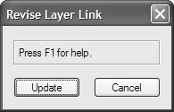
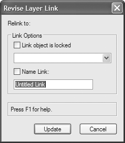

To create custom dialog boxes, scripts utilize a “layout manager” which handles all the details of positioning and
sizing of controls. If you have written custom dialog boxes using previous versions of Vectorworks or MiniCAD
software, you know that the dialog box was treated as a canvas, where dialog box controls were created and
positioned using absolute coordinates. This was often a tedious process, and dialog boxes created on one platform
often did not transfer to other platforms without significant adjustment. Modern custom dialog boxes in scripts treat
the dialog box as a container for the components of the dialog box. Using this methodology allows the details of
control sizing and positioning to be handled by the application and results in dialog boxes which are consistent across
platforms and easier to create.

Modern custom dialog boxes are created in two stages. In the first stage, controls are added to the dialog box
container; this usually involves a series of control definition function calls which specify the controls to be displayed
along with their default properties. Once all the controls for a dialog box have been added to the container, they are
organized for final on screen display.

Organizing controls in modern custom dialog boxes is radically different from the old canvas method in older
versions. Controls are arranged by specifying their position relative to other controls, rather than specifying their exact
location.

While you may specify character widths and heights for certain controls, for the most part the details of positioning
each control are handled for you by the application.

## Defining the Dialog Box Controls

The first step in creating a new custom dialog box is to define the dialog box window and its basic properties. To do
this, we will use the custom dialog box API function `CreateLayout()`, which creates the dialog box window and
defines the title, default button, and help display properties of the dialog box. `CreateLayout()` then returns an
identifier which will be used to add controls to the dialog box. This identifier is also used elsewhere in the script to
refer to the dialog box for control positioning and event handling.

Example:

```pascal
id := CreateLayout('Revise Layer Link',TRUE,'Update','Cancel');
```

The function creates a new empty dialog box, entitled **Revise Layer Link**, which contains a help text area and two
default buttons (**Update** and **Cancel**). The following script creates the dialog box:

```pascal
procedure CreateDialog;
VAR
id: LONGINT;
result : LONGINT;
BEGIN
id := CreateLayout('Revise Layer Link', TRUE, 'Update',
'Cancel');
result := RunLayoutDialog(id,NIL);
END;
RUN(CreateDialog);
```



This is the basic dialog box container in which the rest of the dialog box definition will be created.

`CreateLayout()` allows you some flexibility in creating the dialog box container. If, for instance, you do not wish to
provide help text in a dialog box (in a confirmation dialog box, for example) you can suppress the help text area by
specifying FALSE in the help text display parameter of `CreateLayout()`. `Create Resizable Layout()` can be
used to create a resizable dialog box.

Dialog box buttons can also be suppressed if not needed. Using the example, if the dialog box did not require a Cancel
button, you could suppress it simply by specifying a blank string for the button parameter:

```pascal
id := CreateLayout('Revise Layer Link',FALSE,'Update','');
```

The default button for the dialog box can also be suppressed in this fashion:

```pascal
id := CreateLayout('Revise Layer Link',FALSE,'','Cancel');
```

*It is possible to suppress both default buttons for a dialog box. In this instance, if your code does not provide
some alternate means of dismissing the dialog box, you will be unable to exit it.*

Once you have defined the dialog box and its basic properties, you can begin adding the controls to it. A control is
added to a custom dialog box by calling the appropriate definition function for the control, referencing the dialog box
in which the control will be displayed using the identifier supplied by `CreateLayout()`. In our example, we will be
adding a pulldown menu to display layers that can be selected for the link, controls to let us specify link properties, as
well as some additional controls for descriptive text and to organize the dialog box. The resulting code is shown
below:

```pascal
procedure CreateDialog;
VAR
id: LONGINT;
result : LONGINT;
BEGIN
id := CreateLayout('Revise Layer Link',TRUE,'Update', 'Cancel');

CreateStaticText(id,4,'Relink to:',-1);
CreatePulldownMenu(id,5,32);
CreateGroupBox(id,6,'Link Options',TRUE);
CreateCheckBox(id,7,'Link object is locked');
CreateCheckBox(id,8,'Name Link:');
CreateEditText(id,9,'Untitled Link',26);

SetFirstLayoutItem(id, 4);
SetBelowItem (id,4,6,0,0);
SetFirstGroupItem(id,6,7);
SetBelowItem (id,7,5,0,0);
SetBelowItem (id,5,8,0,0);
SetBelowItem (id,8,9,0,0);
result := RunLayoutDialog(id,NIL);
END;
RUN(CreateDialog);
```

Each control that will be a part of the dialog box is defined with a call to a definition function. The definition for each
control specifies the dialog box in which it should appear, a unique number identifying the control, and the default
properties for the control. The pulldown menu, for example, is created using the function `CreatePulldownMenu()`,
specifying the control ID of 5 and a width of 32 characters. The Set items specify the order and location of the
identified controls (see [Defining the Dialog Box Layout](#defining-the-dialog-box-layout)).



Once the controls have been defined, you can optionally add help text for some or all controls. Help text provides the
user with an easy means of identifying what a control does from within the dialog box, and is usually recommended
for all but the most basic dialog boxes.

The function `SetHelpText()` is used to add help for a specific control. The function associates a help string with a
control; if the cursor is moved over the control when the dialog box is displayed, the associated help string will
automatically be displayed in the help text area of the dialog box. The dialog box control definition code for the help
strings is shown below:

```pascal
SetHelpText(id,1,'Update the selected layer link.');
SetHelpText(id,2,'Cancel the operation and exit.');
SetHelpText(id,4,'New layer to be displayed by selected link.');
SetHelpText(id,5,'New layer to be displayed by selected link.');
SetHelpText(id,7,'Lock the link object after it has been updated.');
SetHelpText(id,8,'Apply an object name to the layer link.');
SetHelpText(id,9,'Apply an object name to the layer link.');
```

In the example, note that we have repeated certain help text strings. We did this in order to provide useful help for the
item whether the cursor was over the actual control or over the label associated with the control. Also, help text was
omitted for the group box control; group boxes do not have associated help text.

## Defining the Dialog Box Layout

Positioning dialog box controls is generally a two step process, where an initial arrangement specifies the relative
position of each control and then any special alignments are specified.

Dialog box items are arranged by setting an initial anchor control and then specifying a chain of controls relative to the
first control. Layouts and group items are the only two objects that can have anchor controls. Anchor controls are set
using either `SetFirstLayoutItem` or `SetFirstGroupItem`. The next item is placed relative to the anchor item
using either `SetBelowItem` or `SetRightItem`. Using these calls, a chain of controls can be created with each item
relative to the other. Group items are just like other items in that any control including another group can be placed to
the right of or below another group.

The initial arrangement generally places items so that their left and top edges are aligned. To specify other alignments
use the `AlignItemEdge` call. In `AlignItemEdge` you specify an edge and an alignment group. All objects in the
same alignment group are aligned together. `AlignItemEdge` also allows you to specify whether you want an object
to shift or resize when performing the alignment.

## Running the Dialog Box

After creating the controls and arranging the layout, the script is ready to run the dialog box. The
`RunLayoutDialog()` function will show the dialog box on screen and begin handling the user interaction with it.
The dialog box will look appropriate for the computer platform it is running on—Macintosh or Windows.

## Handling Dialog Box Events

The script can respond to user events by defining its own event handling function and passing the name of that
function to the `RunLayoutDialog` call. When the user presses a button or clicks in a list, for example, Vectorworks
will call the event handling function. The function will receive the control item number and any appropriate data. The
procedure will be called with an item of `SetupDialogC` before the dialog box is displayed so that the script can
initialize its controls.

```pascal
Procedure HandleEvents( VAR item : LONGINT; data : LONGINT);
Begin
	case item of
		SetupDialogC:
		Begin
			InsertChoice( kPullDown, 0, 'choice 0');
			InsertChoice( kPullDown, 1, 'choice 1');
		End;
		
		kCancelButton:
		Begin
		End;
		
		kOKButton:
		Begin
		
		End;
		
	End;
	
End;
```

## See Also
* [User Interface](User%20Interface.md)
* [Creating a Custom Dialog Box](Creating%20a%20Custom%20Dialog%20Box.md)
* [Plug-in Parameter Types](Plug-in%20Parameter%20Types.md)
* [Search Criteria](Search%20Criteria.md)
* [Include Files and Encryption](Include%20Files%20and%20Encryption.md)
* [Object Events](Object%20Events.md)
* [The VectorScript Debugger](The%20VectorScript%20Debugger.md)