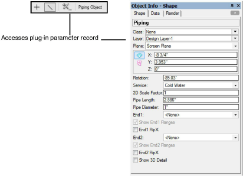
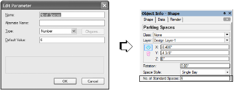
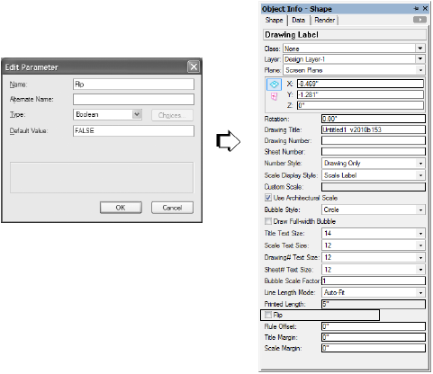
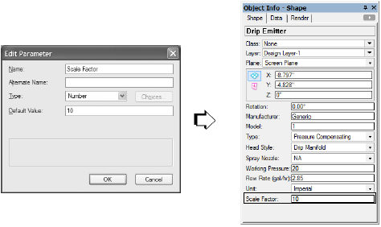
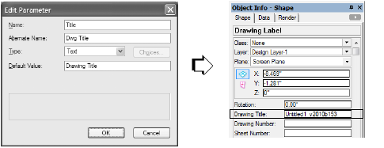
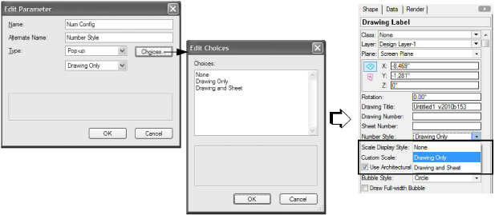
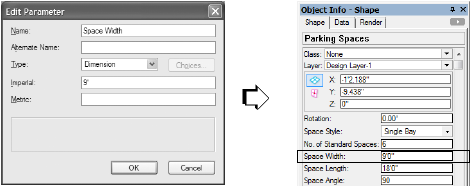
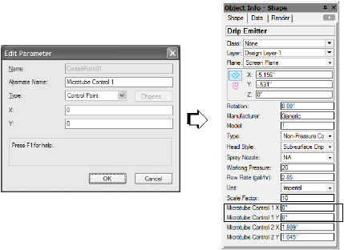

Scripted plug‐in objects allow scripts to be directly integrated into a Vectorworks workspace and be made available to
any Vectorworks file. The three types of plug‐ins—menu commands (.vsm), tools (.vst), and objects (.vso) — allow
scripts to integrate into both workspace menus and tool palettes, as well as other Vectorworks program features such
as the Resource Browser.

When custom plug‐ins are created through scripting, plug‐in parameter values define plug‐in objects and store
persistent values associated with all types of plug‐ins. This section describes the types of parameters and their usage.

## How Parameters Work

Plug‐in parameters are stored in a parameter record, which is a specialized type of Vectorworks record format.
Parameter records are required by scripted objects, but they can be created and associated with any type of plug‐in.

Values are stored in the parameter record by means of parameter fields. These fields act like regular record fields and
can be accessed for reading and writing by the plug‐in script. Parameter fields have distinct data types for storing
different kinds of information; information on specific parameter types is found later in this section.

The values stored in the parameter record of a scripted plug‐in can be used in one of several ways. Objects use the
stored parameter values to define and create the appearance of the object instance. Menu commands and tools use
parameter records to store information for subsequent use with the plug‐in item. Switching files displays stored values
associated with the new file, or, if no parameter record exists, will display the default values of the parameter record as
created by the plug‐in item.

Parameter records can be associated with the plug‐in item itself, or, in the case of objects, can be associated with each
instance of an object placed in a file. When an object instance is placed in the file, the object’s parameter record can be
edited using the Object Info palette. (The Object Info palette also provides a convenient interface for editing the
definition path for path objects.)

| Plug-in Type | Parameter Access |
|--------------|------------------|
| Command      | Parameter records are not visible in the Tool bar or Object Info palette, and cannot be edited from these locations |
| Tools/Objects| When the tool or object is active, click the Tool bar button to access default parameters to use for new object instances, or select an object instance and edit its parameter field values through the Object Info palette  |

## Parameter Types

Scripting provides several parameter field types for use with plug‐ins:
* Integer
* Boolean
* Number
* Text
* Popup
* Radio Button
* Dimension
* X‐Coordinate
* Y‐Coordinate
* Control Point
* Static Text
* Classes Pop‐up

Parameter records can have multiple parameter fields of the same type, or combinations of parameter fields of
different types. The following sections document each parameter type in detail.

### Integer

Integer parameters store a single `INTEGER` data value.

An integer parameter value is displayed in the Object Info palette in an editable field, and can be edited as desired.
Integer parameter fields support calculations in the field, fractional values entered into an integer parameter field will
be rounded to the nearest value.

Integer parameters do not support unit marks or unit conversion.



### Boolean

Boolean parameters store a single `BOOLEAN` data value.

A boolean parameter is displayed in the Object Info palette as a check box, with the state of the check box indicating
the `TRUE-FALSE` state of the value (`TRUE` = checked, `FALSE` = unchecked).

Boolean parameters do not support unit marks or unit conversion.



### Number

Number parameters store a single `REAL` data value.

A number parameter value is displayed in the Object Info palette in an editable field, and can be edited as desired.
Number parameter fields support calculations in the field, and fractional values entered into a number parameter field
will be displayed using the current units fractional display setting.

Number parameters do support unit marks or unit conversion.



### Text

Text parameters store a single string data value. The stored value may be up to 255 characters in length.

A text parameter value is displayed in the Object Info palette in an editable field, and can be edited as desired.



### Popup

Popup parameters store a single `STRING` data value that is selected from a predefined list of values. The list of
available values is defined in the parameter definition dialog box, and cannot be modified during script execution.

Popup parameter values are displayed in the Object Info palette as popup menu listing the defined value options. The
active parameter value (the value which is stored in the parameter) is indicated by the value displayed in the popup
when the control is not selected, and by a bullet next to the item when the control is selected. To modify the value,
select the desired parameter value from the popup control.



### Radio Button

Radio button parameters store a single `STRING` data value that is selected from a predefined list of values. The list of
available values is defined in the parameter definition dialog box, and cannot be modified during script execution.

Radio button parameter values are displayed in the Object Info palette as a series of radio buttons in a group box, with
one radio button for each defined value. The active parameter value (which is stored in the parameter) is indicated by
the selected radio button. To modify the value, select the radio button corresponding to the desired value.

### Dimension

Dimension parameters store a dimension data value as a `REAL` numeric value.

A dimension parameter value is displayed in the Object Info palette in an editable field, and the value can be edited as
desired. Dimension parameter fields support calculations in the field, and fractional values entered into a dimension
parameter field will be displayed using the current unit’s fractional display setting.

Two default values can be specified—one for **Imperial** units, and one for **Metric**. The appropriate dimension is
automatically displayed for the plug‐in depending on the file’s units setting. Entering two default values is not
required; if one default is left blank, the other value is converted to the appropriate value for the units in the file.

*Plug‐ins from versions of Vectorworks earlier than 12 are automatically saved with the dual default value
capability when the plug‐in is edited. The single existing default dimension, if it has a unit, is automatically
saved in the appropriate default value field (Imperial or Metric).*

Dimension parameters support the use of unit markers with values; values stored in one unit format are automatically
converted to an equivalent value if the document unit setting is modified. Units are not required; values without units
assume the drawing units and are not converted.

Dimension parameters are not sensitive to changes in the user origin of a document.



### X-Coordinate

X‐coordinate parameters store a coordinate data value as a `REAL` numeric value.

A coordinate parameter value is displayed in the Object Info palette in an editable field; the value can be edited as
desired. Coordinate parameter fields support calculations in the field, and fractional values entered into a coordinate
parameter field will be displayed using the current unit’s fractional display setting.

Coordinate parameters support the use of unit marks with values; values stored in one unit format will be
automatically converted to an equivalent value if the document unit setting is modified.

Coordinate parameters are sensitive to changes in the user origin of a document, and are designed to be used with
geometric data that is related directly to locations within a Vectorworks document. Values displayed in coordinate
fields will be corrected for any changes in the document user origin.

### Y-Coordinate

Y‐coordinate parameters store a coordinate data value as a `REAL` numeric value.

A coordinate parameter value is displayed in the Object Info palette in an editable field; the value can be edited as
desired. Coordinate parameter fields support calculations in the field, and fractional values entered into a coordinate
parameter field will be displayed using the current unit’s fractional display setting.

Coordinate parameters support the use of unit marks with values; values stored in one unit format will be
automatically converted to an equivalent value if the document unit setting is modified.

Coordinate parameters are sensitive to changes in the user origin of a document, and are designed to be used with
geometric data that is related directly to locations within a Vectorworks document. Values displayed in coordinate
fields will be corrected for any changes in the document user origin.

### Control Points

Control point parameters are a specialized parameter type designed to create control points in plug‐in objects. A
control point is similar to a selection handle and allows the user to click and drag to reshape the object. When created,
a control point parameter consists of two linked coordinate parameters. The two parameters correspond to x‐ and
y‐coordinate fields for the control point.

Control point parameter fields usually display as control labels in the Properties dialog box of an object when it is
created for the first time. Control point fields are normally hidden in the Object Info palette. When the parameters
display, they are a pair of editable coordinate fields; the values can be edited as desired. Control points, like coordinate
fields, support calculations in the fields. Fractional values entered into a control point parameter field will be
displayed using the current unit’s fractional display setting.

Control point parameters support the use of unit marks with values; values stored in one unit format will be
automatically converted to an equivalent value if the document unit setting is modified. Control point parameters are
sensitive to changes in the user origin of a document, and values displayed in the field will be corrected for any
changes in the document user origin.

Control point fields can be renamed by entering a display name in the alternate name field of the parameter. When
referring to the parameter in a script, use the actual definition name of the parameter.



### Static Text

Static text parameters are used to display information on the Object Info palette. The information is for display
purposes, and cannot be edited by the user. This type of parameter might display a calculated field, like the area or
volume of an object, or some other property. Each instance of the object in a drawing can display a different value for
this parameter.

### Classes Pop-up

Allows the user to select a class from a pop‐up of available classes.

## Accessing Parameters from Scripts

Scripting provides a well‐defined mechanism for directly accessing values in parameter records within plug‐in scripts.
This mechanism, known as parameter referencing, allows parameter values to be easily retrieved for use with scripts.

The generalized syntax for parameter references is as follows:

```pascal
P<name of parameter>
```

Parameter names should contain underscores representing any embedded spaces in the parameter name. For example,
a dimension parameter named `Space Width` would be referenced in a script as:

```pascal
PSPACE_WIDTH
```

Parameter references can be used to assign values to other identifiers in a script. Supported identifiers include
variable, array, array element, and structure member identifiers. For example, assigning the value in the parameter to
a variable would be defined as:

```pascal
sp_width:= PSPACE_WIDTH;
```

Parameter references can also be used like constants in expressions or function arguments. For example, valid uses of
`Space Width` parameter would include:

```pascal
totalWidth:= 5 * PSPACE_WIDTH;
CalculateTotal(PSPACE_WIDTH,2);
```

Parameter references should always be treated as constant values. Parameter references do not accept value
assignments, and parameter reference values cannot be modified.

## Setting Parameter Values from Scripts

Scripting uses the `SetRField()` function to write values to parameter records. Scripting also provides two functions,
`GetCustomObjectInfo()` and `GetPluginInfo()` which return the information needed by `SetRField()` to
write values to parameter records.

Using `GetCustomObjectInfo()` or `GetPluginInfo()` with `SetRField()` is relatively straightforward. When
writing a value back to the parameter record of an object instance, first use `GetCustomObjectInfo()` to obtain
information about the object. Once this information has been retrieved, it can be used in conjunction with
`SetRField()` to write the value back to the parameter record. The following example illustrates this technique:

```pascal
BEGIN
    resultStatus:= GetCustomObjectInfo(objName,objHd,recHd,wallHd);

    IF resultStatus THEN BEGIN
        sp_width:= PSPACE_WIDTH;
        // ...existing code...
        sp_width:= 5 * sp_width;
        // ...existing code...
        SetRField(objHd,GetName(recHd),’Space Width’, Num2StrF(sp_width));
    END;
END;
```

In the example, `GetCustomObjectInfo()` is called to obtain the name of the object and a handle to both the object
instance and its associated parameter record. This information is then used with `SetRField()` to write the value to
the parameter record field.

Note that when writing values to the parameter record, the actual name of the field, not the parameter reference, is
used. Parameter references should only be used for retrieving data from the parameter record.

The example also points out one additional requirement for using `SetRField()`. In the example, the value in
`sp_width` is a `REAL`, but `SetRField()` requires a STRING argument for the value being assigned to the record field.

In this case, it will be necessary to convert the dimension value to a `STRING` for compatibility with the function call.
The parameter record will convert the value back to the appropriate data type when it is stored.

The method for writing values to the parameter records of menu commands and tool items is almost identical to the
method used for objects. In the case of menu commands and tool items, the function `GetPluginInfo()` should be
used to obtain the plug‐in name and a handle to the parameter record. The example below illustrates how the function
is used with a menu command:

```pascal
BEGIN
    // ...existing code...
    IF GetPluginInfo(cmdName,pRecHd) THEN
        offvalue:= GetField(5);
        numlines:= GetField(6);
        cmdHd:= GetObject(cmdName);
        SetRField(cmdHd,GetName(pRecHd),'Offset',Num2StrF(offvalue));
        SetRField(cmdHd,GetName(pRecHd),'Lines',Num2Str(0,numLines));
    END;
    // ...existing code...
END;
```

In the example, `GetPluginInfo()` is used to obtain the name of the menu command and a handle to the parameter
record. This information is used with `SetRField()` to write values to the parameter record of the menu command.

Parameter records for menu commands and tool items are very useful for storing information between uses of the
command or tool item. For example, if a user modifies the default settings of a tool item, this information can be stored
and reused on subsequent uses of the tool.

*Like objects, records for menu commands and tool items are stored with a Vectorworks file; switching files may
cause the default settings for a command or tool item to change.*

## Setting Parameter Visibility

By default, all plug‐in parameter users interface controls are enabled and visible. This behavior may be overridden
using `SetParameterVisibility()` and `EnableParameter()`. Using `GetCustomObjectInfo()` or
`GetPluginInfo()` with these procedures is relatively straightforward. First, use `GetCustomObjectInfo()` to
obtain information about the object. Once this information has been retrieved, the plug‐in parameter’s user interface
attributes can be specified. In each case, the parameter argument is the universal name of the plug‐in’s parameter. For
example:

```pascal
BEGIN
    // ...existing code...
    resultsStatus := GetCustomObjectInfo(objName,objHd,recHd,wallHD);
    IF resultStatus THEN BEGIN
        EnableParamter(objHD, ‘Space Width’. FALSE);
        {Disables the control for the Space Width parameter}

        SetParameterVisibility(objHd, ‘Space Depth’. FALSE);
        {Hides the control from the Space Width parameter}
        // ...existing code...
    END;
END;
```

Like the plug‐in object example above, plug‐in menus and tools that use parameters can use
`SetParameterVisibility()` and `EnableParameter()`.

```pascal
BEGIN
    // ...existing code...
    IF GetPluginInfo(cmdName,pRecHd) THEN
        cmdHd:= GetObject(cmdName);
        EnableParameter(objHd, ‘Offset’. FALSE);
        SetParameterVisibility(objHd, ‘Lines’. FALSE);
    END;
    // ...existing code...
END;
```

## Setting Default Parameter Visibility

Additionally, default parameter visibility may be set for objects, menus, and tools in the Plug‐in Editor/Edit Parameter
dialog box. By placing two leading underline characters as a prefix to the parameter’s universal name, the parameter
visibility is set to false. Using this technique hides a parameter in the default settings dialog box for a plug‐in.
Parameters with this special universal name prefix will not be shown unless explicitly made visible using
`SetParameterVisibility`.

## See Also

* [User Interface](User%20Interface.md)
* [Creating a Custom Dialog Box](Creating%20a%20Custom%20Dialog%20Box.md)
* [Plug-in Parameter Types](Plug-in%20Parameter%20Types.md)
* [Search Criteria](Search%20Criteria.md)
* [Include Files and Encryption](Include%20Files%20and%20Encryption.md)
* [Object Events](Object%20Events.md)
* [The VectorScript Debugger](The%20VectorScript%20Debugger.md)
