There are several ways to present a scripted user interface to display or gather information from the user. These
include Help Tags, Tool Tips, Messages, Predefined Alerts, and Custom Dialog boxes. This section briefly introduces
these features, and then describes Custom Dialog boxes in detail.

The simplest user interface feature that script plug‐ins should support is Help Tags or Tool Tips. This feature simply
identifies the plug‐in by name (and an additional short description) when the user hovers the cursor over a tool icon or
a menu item.

The “Script Message” palette is another simple user interface feature. A script can call the “Message()” function to
display one line of information to the user. The function takes multiple arguments, and will concatenate the pieces
together. This feature can be used for status or progress information. Since it is a palette, not an alert, it does not
interrupt the user’s workflow.

## Predefined Alerts

To notify the user of an error condition, provide a warning, or ask for confirmation, a script can use one of the several
predefined alerts. With one function call the script can easily present a modal alert dialog box which requires the
user’s attention before he or she can continue. For example:

```pascal
AlrtDialog('You must select an object first.');
```

Another predefined alert will display a string which is typically a question, and provide “Yes” and “No” buttons:
```pascal
response := YNDialog('Do you wish to continue?')
```

There are several functions that allow the user to enter values. For example, the function `StrDialog` allows the user
to enter a string and the function `PtDialog` allows the user to enter a point value. See the Function Reference for a
complete list of these predefined alert functions.

:More complex dialog boxes can have the appearance of an alert with the Standard Icon control.(See [User_Interface#Standard Icon](#standard-icon) ).

## Custom Dialog Boxes

Scripting provides the custom dialog box API for scripts whose interface needs may exceed what is provided by the
predefined dialog boxes available in the language. Scripts may create dialog boxes using any combination of controls
(up to 10,000 controls per dialog box) in layouts that can be tailored to meet your specific interface needs. Scripting
allows up to 32 dialog boxes per script, which create sophisticated interfaces for menu commands and tools. All the
components required to build and manage dialog boxes for handling complex data entry and user interaction are
provided.

Topics discussed in this section include the dialog box control components, dialog box definition and layout, as well as
handling user interaction. The section also addresses the use of external resource files for storing image and string data
and how to use them in creating custom dialog boxes.

:''The custom dialog system that was introduced with Vectorworks 8.x is covered here. It is sometimes referred to''
:''as the “Modern Dialog” system or the “Layout Manager” dialog system. For a limited time, Vectorworks will''
:''continue to support existing scripts which may use the previous dialog box system. These functions are referred''
:''to as “Classic Dialogs” in the Function Reference.''

### Custom Dialog Box Concepts

Dialog box interfaces are a means of retrieving information from the user for use by the script during execution. In
order to do this, dialog boxes need to be able accept data entry (in various formats) and provide meaningful
interaction and feedback for the user. Using Vectorworks software, you have probably encountered dialog boxes
whose interface is tailored to a specific task (such as creating a layer or setting document scale) and which provide
feedback based on the data you have entered. These dialog boxes use the same underlying concepts that you will be
using in creating custom dialog boxes for your scripts.

### Controls

Every custom dialog box is comprised of **dialog box controls**, items which accept user input of one kind or another.
Dialog box controls are designed using easily understood metaphors which allow the user to quickly comprehend
how a dialog box control operates. Once the user understands these simple concepts, it becomes easy for the user to
quickly enter data and define complex combinations of settings for a given task. Controls are also designed to provide
interactive feedback for the user which guides and informs them as they interact with the dialog box.

Controls are organized within the dialog box by means of a **dialog box layout**, which positions and orients the
controls for display. The dialog box layout provides a logical structure for the controls, allowing the user to quickly
process information contained in the dialog box as well as facilitating data entry into the dialog box.

Scripting provides a rich set of predefined controls for use in custom dialog boxes. Along with definition functions for
each control, scripts can provide functions for defining and managing the dialog box layout, as well as functions for
managing control‐related data and for creating associated help for each control.

### Events

From the script side, the interaction between the user and the dialog box is viewed as a series of events. Each action the
user initiates (such as a keystroke or a mouse click) is viewed as a discrete event which is passed to and processed by
the script. The actions taken by the script in response to an event vary from script to script, and are defined according
to what the script is designed to accomplish. This flexibility in handling of events is what makes it possible to apply a
relatively small set of dialog box features to a wide range of script applications.

Processing of user events in scripts is accomplished through the use of a structured subroutine known as the **event
handler function**. The event handler function contains all the code needed to manage the operation of the dialog box
while it is displayed.

## Custom Dialog Box Controls

Scripts can provide a wide range of control types for use in creating custom dialog boxes. In addition to basic control
types such as editable text fields and radio buttons, scripts can also contain specialized controls such as sliders, color
palettes, and edit fields which support numeric data entry. This section lists the custom dialog box controls currently
available.

### Check Box

Check box controls display a standard check box option control.


Check boxes are traditionally used to display options that can be set independently of other option items in a dialog
box.

#### Three-state Check Box

A special type of check box allows three states to exist: an on, off, and indeterminate state.


#### All/None Check Box

The All/None check box turns on or off all check box items in a group box.
* Checked box: All items in the group are selected; click to deselect all items.
* Empty box: No items in the group are selected; click to select all items.
* Indeterminate state box   (Windows) or  (Macintosh): One or more items in the group are not selected; click
to select all items.


### Color Popup

Allows the user to select a color from the Color Palette set.

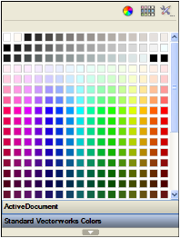

### Color Palette

Color palette controls display a system color palette when clicked. The selected color value is returned for use in the
script.

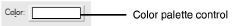

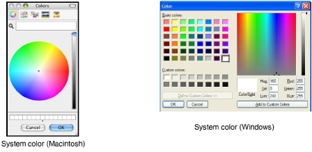

The value returned by the color palette control is a decimal representation of a hexadecimal color value. This value
must be converted to corresponding RGB values for use with scripted color functions.

### Edit Integer

Edit integer controls are a specialized type of edit control designed for handling numeric input. Edit integer controls
return values directly as an INTEGER value, eliminating the need for string‐number conversions.


Edit integer controls also support in‐line expressions which result in a numeric value.

### Edit Real

Edit real controls are a specialized type of edit control designed for handling numeric input. Values from edit real
controls are returned directly as a REAL value, eliminating the need for string‐to‐number conversions.


Edit real controls can be configured to display the field value in one of several formats, such as dimensions or angular
values. Edit real controls also support in‐line expressions which result in a numeric value.

### Edit Text

Edit text controls display a single‐line editable field in which the user can enter or modify text.

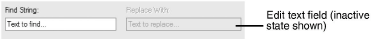

The text value contained in the control can be retrieved using functions provided by the API. Text contained within an
the control can also be updated during run‐time. Text in edit text controls is always left‐justified.

### Edit Text Box

This is a multi‐line editable field with a vertical scroll bar.


### Gradient Slider

The gradient slider can be used to indirectly manipulate gradient resources.

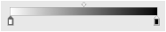

### Group Box

Group boxes are used to associate related items in a dialog box. Other controls, such as radio buttons, pulldown
menus, and even other group boxes, can be embedded within a group box control.

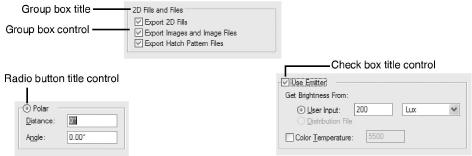

The size of the control is determined by the size of the controls which are embedded in the group box. The title of a
group box is optional; group boxes defined without titles will display with a complete box border. Group boxes do not
return a data value.

Group box titles can consist of a control (check box or radio button) or static text. The title control automatically
enables or disables all other controls contained within the group box.

Group box borders can also be configured as invisible to group items as a layout unit within the dialog box.

Group boxes and the controls contained within them can be treated as a single control when performing dialog layout.
Adjustments to the group box control will automatically adjust any controls contained within the group box.

### Three State Check Box Group Box

A special type of title control check box allows three states to exist for the group box check box (on, off, and
indeterminate state).


### Pulldown Menu Group Box

A group box control can be in the form of a pulldown menu.


### Image

Image controls display an image or texture.

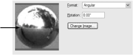

### Image Pane

Image pane controls display an image retrieved from a script resource file:


Image pane controls are sized to the dimensions of the graphic image being displayed. The graphic displayed in the
image pane control can be updated during script run‐time by setting the active image resource for the control.

### Image Popup

Image popup controls allow the user to display a selectable preview list of resources.

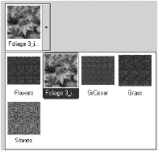

### Interactive Open GL Custom Controls

Allows users to zoom, pan, and use interactive features such as transparency and animation.

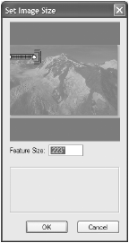

### Line Attribute Popup

Allows the user to select a combination of line thickness and simple line type.

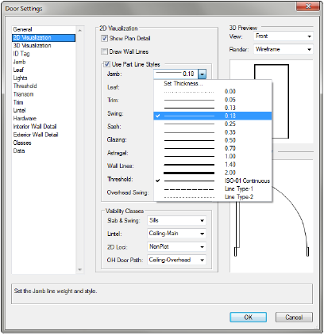

### Line Style Popup

Allows the user to select from the simple line types defined in the file.

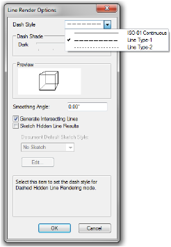

### Line Weight Popup

Allows the user to select from the line thicknesses defined in the file.

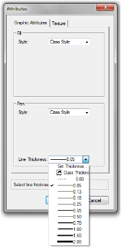

### List Box

List box controls display a menu containing one or more selection options in a list box format. The user may select an
option from the available list items as the active control option.


The user‐selected option is highlighted in the list box view. List box options can be navigated by highlighting or
tabbing into the control and using the arrow keys to move up and down the list of items available in the control.
Scripted API functions for retrieving and managing pulldown menu control options also work with list box controls.

As of Vectorworks version 10, list boxes can have multiple columns, each with its own column width. By default, list
boxes are created with one column. To add a column, use the function AddListBoxTabStop, which takes a tab stop
as a parameter. Each tab stop is given as a character position. Hence, each succeeding tab stop must be at a greater
character position than the previous one.

Once all tab stops have been set up, data can then be added to the list box (all tab stops must be set before data can be
added). Data is added in the usual way, using calls to InsertChoice. To align text at a tab stop, tab characters are
inserted in the string passed to InsertChoice. The string for an entire line must be passed to InsertChoice all at
once; it is not possible to pass just a part of a line.

### List Browser

List browser controls can display a collection of items; each item can display one or more columns of associated
information. Information in items can be displayed as text, an icon, or both. Each column can also display text
information or an icon above the items in column headers. The item information can either be static (not changed by
the user), or edited by an in‐place editing control. Currently, the available editing controls are the multi‐item radio edit
control and the multi‐state edit control.

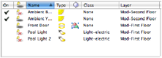

To create a new list browser control, call the function `CreateLB`, specifying the desired width and height. By default,
there is one column of data. To add more columns, call `InsertLBColumn` in the SetupDialogC case of the dialog
handler routine. To add rows of data to the list browser, call `InsertLBItem` for each row. There are many more
functions to customize the list browser; see the Function Reference for details.

### Marker Popup

Allows the user to select a line marker style.

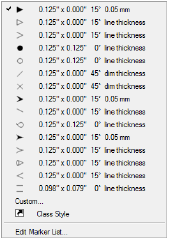

### Pattern Popup

Allows the user to select a fill pattern from the pattern palette.

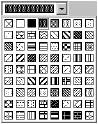

### Pulldown Menu

Pulldown menu controls display one or more selection options in a menu format. The user may select one item from
the available options as the active control option.


When in its closed state, the active menu option is displayed in the control. When the control is selected, all menu
options are displayed, with the active option highlighted:


Pulldown menu options can also be navigated by highlighting or tabbing into the control and using the arrow keys to
move up and down the list of options.

Scripting provides API functions for retrieving and managing pulldown menu control options.

### Enhanced Pulldown Menu

The enhanced pulldown menu adds icons and hierarchical menus. The 16 x 16 icon is optional.


### Push Button

Push button controls display a standard dialog box button. The control is automatically sized based on the specified
text string.


Button text can be updated at runtime using the `SetControlText` function.

### Radio Button

Radio button controls display a standard radio button option control.

Radio buttons are traditionally used in pairs or groups of three to display a set of related options where only one of the
settings is active at any time. Related radio button controls are referred to as a radio button group.


### Separators

A line can be added to a dialog box group box to separate the items. Enter 0 as the separator’s length to automatically
size the line length to that of a group (if the line is part of a group) or dialog box (if the line is not part of a group).


### Image Pop-up Separator

An image pop‐up separator adds a line to an image pop‐up to separate the items.

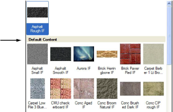

### Pulldown Separator

A pulldown separator adds a line to a pulldown menu to separate the items in the menu list.

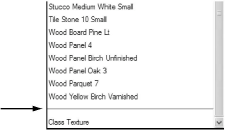

### Slider

Slider controls allow the user to select from a range of allowable values by positioning the control’s slider bar indicator.

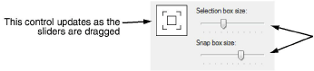

Slider controls are displayed with a fixed width, and are only displayed in a horizontal orientation.

Slider controls display range increments as tick marks located under the slider bar. The range increment is a fraction of
the maximum value specified for the slider; the number of marks displayed can vary from 1 to 10, depending on the
specified value.

The slider control can be set so that other controls on the dialog box update in real‐time while the slider is being
dragged.

### Static Text

Static text controls display a non‐modifiable text string in the dialog box. They are used as labels for other controls, or
to display informational text.


Static text strings are left‐justified by default; limited right‐justification can be obtained by using alignment functions
provided by the API. Static text controls support updating of the control text during script run‐time.

The following styles are supported for static text controls:

| Style    | Value    |
|----------|----------|
| Plain    | 0        |
| Bold     | 1        |
| Italic   | 2        |
| Underline| 4        |

Create combinations of styles by adding the style values: for example, Bold + Italic = 3, and Bold + Underline = 5.
Specify color by providing a RGB index ranging from 0‐255.

The specified style and color apply to the entire block of text. Styling of individual characters or range of characters is
not supported. However, effects as seen in the text below can be accomplished by using two separate text blocks
placed next to each other. The first block would have a width of ‐1 to enable automatic sizing, and would contain no
text or color styles. The second block would be set to the right of the first, and would contain the italic style with a blue
color.


Static text and images can also generate mouse click events, similar to hyperlinked text. When the mouse is hovered
over a static text field or image that supports click events, the mouse cursor changes to the standard hand cursor.


### Standard Icon

Several script routines exist for presenting simple alert dialog boxes (see [User_Interface#Predefined Alerts](#predefined-alerts) ). However,
with the Standard Icon control, it is possible to present a more complex dialog box, and still give it the appearance of
an alert.

To create a standard icon in a dialog box, call the function `CreateStandardIconControl` and specify one of the
icon numbers. The icon should be positioned at the top left corner of the dialog box.

| Icon Number | Icon name          | Icon Image                |
|-------------|--------------------|---------------------------|
| 0           | Application icon   |  |
| 1           | Informational icon | |
| 2           | Stop               | |
| 3           | Warning            | |
| 4           | Question mark      | |

### Swap Control

A swap control manages multiple overlapping groups of controls. Only one group is visible at a time. In this way, it is
very similar to a Tab Control, except that the Swap Control does not provide tab buttons for the user to click. The
swapping is done programmatically, and can be hooked up to any other control or event.

For example, a dialog box may contain a scrolling list of items on the left, and a swap control on the right. As the user
selects items in the list, the swap control can respond by changing the active pane on the right. This can be used for a
settings type of dialog box, or when there are too many choices to use a Tab control effectively. Another example
would be a dialog box with a set of radio buttons to control which swap pane is visible.

To create a new swap control, call the function `CreateSwapControl`. Then, for each possible swap pane, create a
group control, place other controls inside the groups, and call the function `CreateSwapPane`. In the event handling
routine for the dialog box, call the function `DisplaySwapPane` in response to the appropriate user actions.

### Tab Pane

The tab pane control creates a dialog box that uses tab panes. A tab “button” is visible for each pane, with one pane
visible at a time. The tab control can also be part of a dialog box.

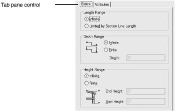

## See Also
*[User Interface](User%20Interface.md)
*[Creating a Custom Dialog Box](Creating%20a%20Custom%20Dialog%20Box.md)
*[Plug-in Parameter Types](Plug-in%20Parameter%20Types.md)
*[Search Criteria](Search%20Criteria.md)
*[Object Events](Object%20Events.md)
*[Include Files and Encryption](Include%20Files%20and%20Encryption.md)
*[The VectorScript Debugger](The%20VectorScript%20Debugger.md)
